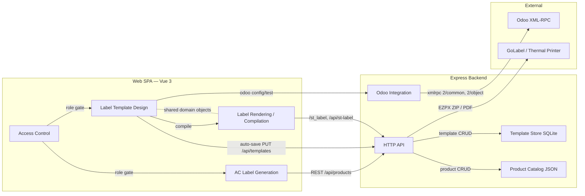
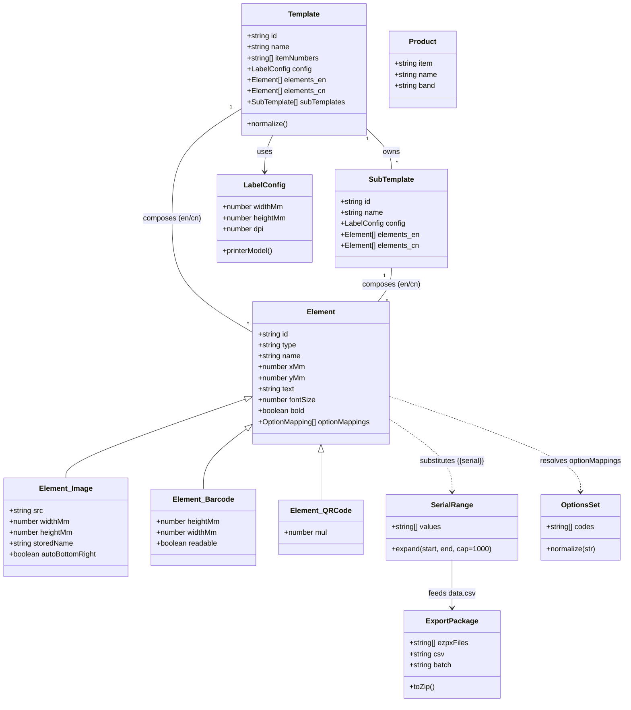

# DDD Analysis Report — acbarcode / Barcode Label Maker

| Field    | Value |
|----------|-------|
| Created  | 2026-08-14 |
| Author   | DDD Workflow (opencode) |
| Version  | 1.0.0 |
| Status   | DRAFT (retroactive analysis of existing codebase) |

---

## 1. Context Decomposition

| Module / Subsystem | Bounded Context | Primary Files |
|--------------------|-----------------|---------------|
| Auth gate + session/RBAC | Access Control (shared, cross-context) | `src/components/LoginPage.vue`, `src/App.vue`, `server/index.js` (adminAuth) |
| AC product catalog + CRUD | Product Catalog | `server/index.js` (products API), `src/components/LabelMaker.vue` |
| AC barcode label generation / PDF | AC Label Generation | `src/components/LabelMaker.vue` (JsBarcode/jsPDF) |
| Template store (SQLite) | Label Template Design | `server/templateStore.js`, `src/stores/templateStore.js`, `src/utils/stTemplateManager.js` |
| Template manager UI | Label Template Design | `src/components/st/StTemplateManagerPage.vue` |
| Label designer (elements, EN/CN, sub-templates) | Label Template Design | `src/components/StLabelDesigner.vue`, `src/components/st/StElementsManagerCard.vue`, `StCanvasConfigCard.vue` |
| Live canvas preview | Label Rendering / Compilation | `src/utils/stCanvasRenderer.js`, `src/components/st/StCanvasPreviewCard.vue` |
| EZPL / EZPX / CSV / ZIP / SUTO Protocol compilation | Label Rendering / Compilation | `src/utils/stEzplCompiler.js`, `src/utils/stEzpxCompiler.js`, `stEzpxParser.js`, `stOptionResolver.js`, `stSutoProtocol.js`, `stSerialRange.js`, `stGoLabelBatch.js`, `server/ezpxGenerator.js` |
| ST server-side PDF / EZPX APIs | Label Rendering / Compilation (server boundary) | `server/index.js` (`/api/st-label`, `/st_label`) |
| Odoo config + XML-RPC test search | Odoo Integration | `server/index.js` (xmlrpc section), `src/components/OdooServerModal.vue` |

---

## 2. Domain Model Catalog

### Aggregate Roots

| Aggregate | Identity | Managed Invariants | Owns |
|-----------|----------|--------------------|------|
| **Template** | `id` (uuid) | ≥ 1 template exists; schema normalized on write; config defaults `{35,22,203}` | `itemNumbers[]`, `config`, `elements_en[]`, `elements_cn[]`, `subTemplates[]` |
| **Product** (AC catalog) | `item` (unique, case-insensitive) | item + name required; band ∈ {`atlascopco`,`pneumatech`} | `name`, `band` |

### Entities

| Entity | Context | Notes |
|--------|---------|-------|
| `SubTemplate` | Label Template Design | Nested under Template; own `config` + EN/CN elements; one level only |
| `OdooRecord` (mrp.production / stock.lot read) | Odoo Integration | Value-mapped read model: `name`, `product_description_variants`, `product_id`, `origin`, `state` |

### Value Objects

| Value Object | Context | Properties |
|--------------|---------|------------|
| `Element` (leaf) | Label Template Design | `type` (`text`/`image`/`hline`/`vline`/`barcode`/`qrcode`/`folder`), `xMm`, `yMm`, `fontSize`, `bold`, `widthMm`, `heightMm`, `readable`, `mul`, `src`, `storedName`, `text`/`data`, `optionMappings` |
| `LabelConfig` | Template Design / Rendering | `widthMm`, `heightMm`, `dpi` (203/300/600) |
| `SerialRange` | Rendering | expanded strings, prefix + zero-pad, max 1000 |
| `OptionsSet` | Rendering | normalized uppercase option codes |
| `Serial` (ST) | Rendering | 8-digit → `NNNN NNNN` formatted; max 10 per batch |
| `PrinterTarget` | Rendering | dpi → model: 203→`G500`, 300→`EZ-1300+`, 600→`RT863i+` |
| `ExportPackage` | Rendering | `.ezpx` file(s) + `data.csv` + `print_labels.bat` → ZIP |
| `Brand` (band) | AC Generation | `atlascopco` → `/logo.png`, `www.atlascopco.com`; `pneumatech` → `/pneumatech_logo.png`, `www.pneumatech.com` |

---

## 3. Business & Hardware Invariants (enforced by the domain layer)

1. **Template minimum**: delete refused when only one template remains (`server/index.js` 400; `templateStore.deleteTemplate` guarded).
2. **Normalized template shape**: every write passes `normalizeTemplate`/`normalizeSubTemplate`; malformed inputs default safely.
3. **AC batch size ≤ 10** serials; **serial range ≤ 1000** labels.
4. **Serial format**: ST 8-digit serials displayed as `NNNN NNNN`.
5. **Physical correctness**: all coordinates/sizes are mm, converted per DPI (`mm / 25.4 * dpi`); auto-bottom-right images inset 1mm; line width derived from endpoint deltas.
6. **Empty elements don't print**: option-mapped text/barcode/QR elements resolving to empty are skipped in EZPX compilation.
7. **Serial commands**: CSV-database mode uses `^F00` (one label per CSV row); counter mode uses `^C00` with `SerialFormat "start,+step,Prompt,low,high"` and `SerialLeadingCode` zero-pad flag.
8. **Unique product item numbers** on create (server 400 on duplicate).
9. **Admin-only writes** to products and templates (header `x-admin-password`).
10. **Odoo auth reuse**: UID cached per `url|db|username|password`; cache cleared on config change and on auth failure, then re-authenticated.

---

## 4. Context Map Diagram

Relationship notes:
- **Shared Kernel**: `Template` / `Element` / `LabelConfig` models are shared between
  the frontend store, the compiler pipeline, and the SQLite store — keep them in one
  shape (see `20-api-contract.md`).
- **Conformist**: the EZPX / EZPL output is a conformist adapter to the GoLabel /
  EZPL printer contract (we cannot change the printer format; we conform to it).
- **Customer–Supplier (Odoo)**: Odoo is the upstream supplier; the app consumes a
  narrow read-model (`stock.lot`, `mrp.production`) through an Anti-Corruption Layer
  (`odooXmlRpcCall` / `xmlRpcToJs`), so Odoo domain changes don't leak into the app.

---

## 5. Domain Model Diagram

---

## 6. Suggested Next Steps (not yet implemented)

1. Introduce **Vitest** and cover the pure modules per `30-testing-standards.md`.
2. Extract the Express `app` from `server/index.js` to make it importable for tests.
3. Move hardcoded credentials to environment configuration (coordinated plan only).
4. Add a schema/version field to `Template` to support forward migrations in the SQLite store.
5. Promote `stOptionResolver` / compiler module contracts to a single documented
   `Element` type definition shared by frontend + server.
