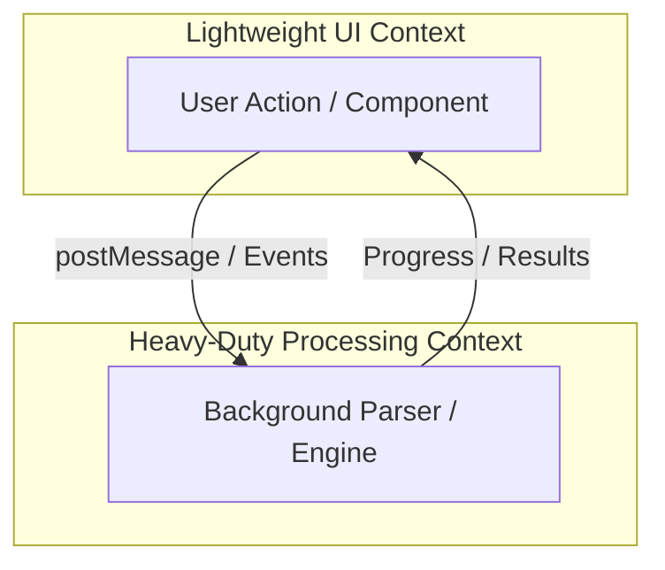
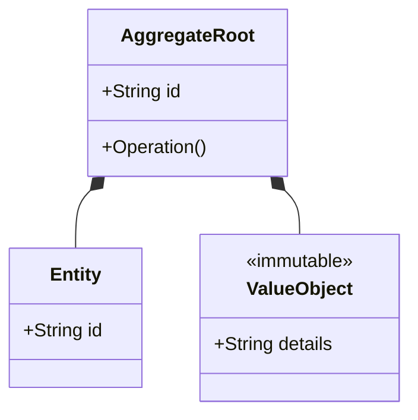
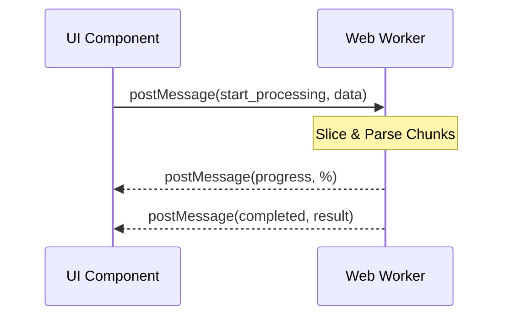

# Rule 10-domain-analysis.md: Demand Analysis & Business Context Guidelines (Creator Center)

This rule guides the AI during the initial project scoping phase to perform Bounded Context decomposition and Domain-Driven Design (DDD) on product requirements located in the `docs/prd/` directory. This ensures a unified consensus on project scope and design granularity across teams.

## 1. Trigger Scenario & Goal
- **Trigger**: When the user request contains the keyword `ddd` (case-insensitive) or when analyzing raw requirements, feature specifications, or user stories in the `docs/prd/` directory. This trigger mandates outputting a Domain-Driven Design (DDD) Analysis Report before code implementation.
- **Core Objective**: Automatically structure and identify domain boundaries and business invariants, providing a standardized model skeleton for API contract design and backend services.

---

## 2. Domain Modeling & Entity Design Guidelines
When processing requirements, the AI **must** strictly apply Domain-Driven Design principles using the following classifications:

### A. Domain Model Classifications
- **Core Entities**:
  - **Project**: Details about the uploaded document, including `name`, `content_type` ("docx" or "markdown"), paths to `original_file` (if DOCX), raw `markdown_content` and `placeholder_md` (if Markdown), translation languages, status, and creation/update timestamps.
  - **Segment**: Individual translatable textual units. Contains sequences, paragraph indices, run formats, container classifications ("paragraph", "table_cell", "header", "footer"), mapping to `translation_keys`, the resolved translation, and ignore flags.
  - **TranslationKey**: Unique registry storing a unique `source_text` to deduplicate and cache translations across segments globally.
  - **TranslationValue**: Associated translations mapped by language (`target_lang`) and linked to a key. Tracks manual editing overrides (`is_edited`).
- **Value Objects**:
  - **ProjectStatus**: `uploaded`, `parsed`, `translating`, `translated`, `reviewed`, `exported`, `error`.
  - **ContentType**: `docx`, `markdown`.
  - **SupportedLanguages**: `EN`, `DE`, `CN`, `JP`, `FR`, `ES`, `KO`, `PT`, `IT`, `RU`, `AR`.

### B. Bounded Context Classifications
The AI must classify business subdomains into one of two contexts:
1. **Heavy-Duty & Background Processes Context**:
   - **PDF & Document Export Context**: Rebuilding `.docx` documents by inserting translation text back into original run trees, rendering markdown or segment lists to styled HTML/CSS, compiling HTML to PDF using WeasyPrint ([pdf_export.py](file:///Users/ex/project/smallNfast/creatorcenter/backend/pdf_export.py)), and managing asynchronous export jobs with SSE progress indicators.
   - **Automatic Machine Translation Context**: Batching untranslated keys, communicating with external translation APIs (OpenL, MiniMax), enforcing batch constraints (3 for OpenL, 25 for MiniMax), and applying rate-limiting delays.
2. **Lightweight User Interaction Context**:
   - **Upload & Parsing Context**: Handling `.docx` uploads and parsing text via python-docx (merging matching runs), or parsing Markdown (tokenizing elements, replacing text with placeholders).
   - **Segment Editor Context**: Displaying and pagination of translatable segments, updating individual translation values, and applying auto-propagation across matching segments.
   - **Translation Database (Global Keys) Context**: Viewing and managing global keys and values.
   - **Image Asset Upload Context**: Storing and resolving segment-associated images under size constraints (max 10MB).

---

## 3. Standard Analysis Output Skeleton
When responding to analysis tasks, the AI **must** output its findings using the following Markdown template:

# Domain-Driven Design (DDD) Analysis Report - [Feature Name]

## 1. Bounded Contexts & Classifications
*Context names, responsibilities, and classification (Heavy-Duty / Lightweight).*

### Context Map (Mermaid Diagram)
*Include a Mermaid diagram visualizing the bounded contexts and their interaction (e.g., UI vs Worker threads).*

## 2. Core Domain Entities & Attributes
- **[Entity Name]**:
  - Attributes: *Attribute list and data types*
  - Business Rules & Ownership: *e.g., Global keys deduplicate translation records, editing propagates translations to all segments, etc.*

### Domain Model (Mermaid Diagram)
*Include a class diagram showing entities, value objects, and aggregate roots.*

## 3. Business Invariants & Constraints
- **File Upload Limits**: Document files max 50MB; Image files max 10MB.
- **Image Normalization**: Rewriting image pathways to filesystem roots, converting HTML presentation formatting to inline CSS.

## 4. Execution & Offloading Strategy
- Identify which endpoints must run asynchronously via `BackgroundTasks` (e.g. PDF generation, API translations) and how progress is communicated.

### Sequence Flow (Mermaid Diagram)
*Include a sequence diagram showing async/worker execution flow.*

