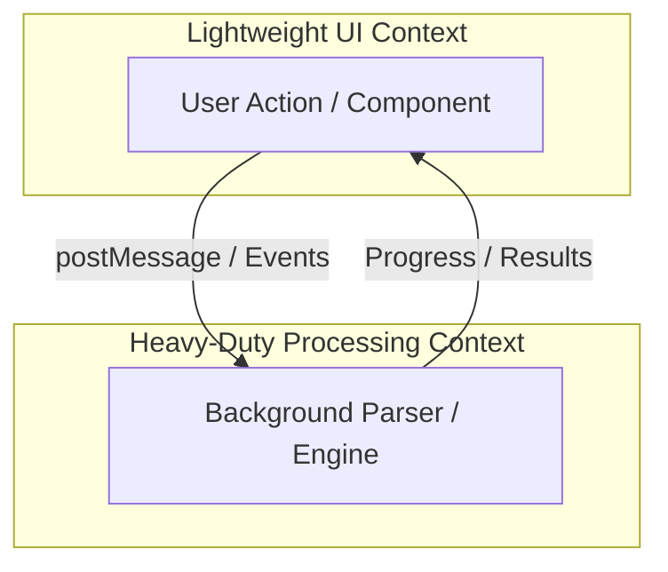
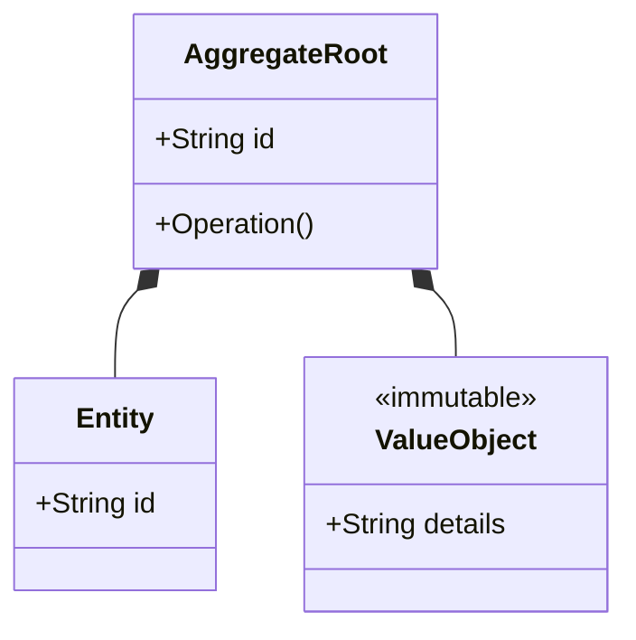
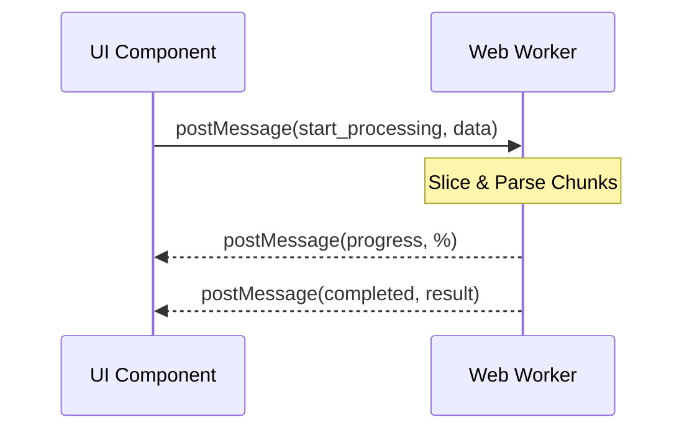

# DDD & Agent-Rules Guided Project Development Skill

> **Triggers:** `ddd`, `ddd_workflow`, `init ddd`, `domain-driven design`

This skill defines a robust, structured process for initiating projects and developing new features using Domain-Driven Design (DDD), strict API contracts, and automated validation.

---

## 1. Project Initialization Workflow
When starting a new project, or bootstrapping an existing one to support this workflow, the following structural files and folders must be established:

### 1. `GEMINI.md` (Project Rules & Context)
Placed at the root of the project. It serves as the single source of truth for developer and agent alignment on codebase patterns, system architectures, and guidelines.
* **Purpose:** Instructs the LLM/Agent on local tech stack choices, styling parameters, performance boundaries, and design constraints unique to the repository.
* **Required Structure:**
  - **Project Context:** High-level platform architecture (e.g., React, Node, Vite), target platforms, and runtime environments.
  - **Core Business & Concurrency Constraints:** Mandatory performance patterns, thread offloading rules (e.g., Web Workers for parsing, concurrency limits, file processing size ceilings).
  - **Design System & UI Guidelines:** Specific hex color values (Primary, Secondary, Neutrals), typography rules, component libraries to use (e.g., Material UI), loading indicators, and required micro-animations.
  - **Frontend/Backend Standards:** Code organization guidelines, language standards, framework rules, styling architectures (e.g., Vanilla CSS vs CSS-in-JS).
  - **Error Handling & Feedback Protocols:** Exception propagation rules, worker-to-main-thread messaging schemas, UI alerts/toast guidelines.
  - **Developer Interaction Protocol:** Query format templates, required fields for proposing new features.

### 2. `docs/prd/` (Product Requirements Document Directory)
A dedicated directory for PRDs.
* **Purpose:** Stores PRDs that document feature scopes, business requirements, and functional specifications.
* **Initialization Rule (No `README.md`):** Do NOT create any `README.md` files in this directory.
* **Existing/Old Project Bootspan:** If initializing this workflow on an existing/old project, you **must analyze the codebase first** and generate a comprehensive `docs/prd/prd.md` file. Assume the current project was built to implement this baseline `prd.md` and document all existing features, workflows, and business rules accordingly.
* **Future Feature PRDs:** For new features, create separate PRD files in this directory using the naming convention `[feature_name]_prd.md` (e.g., `password_protection_prd.md`).
* **Expected Document Template:**
  - **Metadata:** Creation Date, Author, Version, Status (Draft/Approved).
  - **Objective:** The user problem, target audience, and business goals.
  - **User Stories:** Narrative user scenarios and clear acceptance criteria.
  - **Functional Requirements:** Interactive modules, form behaviors, loading states, error dialogs.
  - **Technical & Security Constraints:** Network limits, browser compatibility, session management, or backend rate limits.

### 3. `docs/report/` (DDD Analysis & Architectural Reviews)
A dedicated directory for engineering reports, architectural analysis, and DDD boundary diagrams.
* **Purpose:** Archives design reviews and DDD Analysis Reports to ensure architectural decisions, bounded contexts, and domain entities are explicitly defined and approved before coding.
* **Initialization Rule (No `README.md`):** Do NOT create any `README.md` files in this directory.
* **Existing/Old Project Bootstrapping:** If initializing this workflow on an existing/old project, you **must generate a retroactive DDD Analysis Report** at `docs/report/ddd_prd_report.md` referencing the generated `docs/prd/prd.md`. This report must map the existing codebase's Bounded Contexts, Core Entities, Invariants, and Worker Offloading strategies as if they were designed under this DDD workflow.
* **Future Feature Reports:** For new features, create separate report files in this directory using the naming convention `ddd_[feature_name]_prd_report.md` (e.g., `ddd_password_protection_prd_report.md`).
* **Required Structure:** Refer to Section 3 for the detailed DDD Analysis Report template.

### 4. `.agents/rules/` (Agent Action Guidelines)
A directory containing precise, actionable rule files that AI agents read and adhere to during the lifecycle of the project.
* **Purpose:** Standardizes code reviews, API structure design, testing procedures, git hygiene, and project safety across all automated agents and human developers.
* **Standard Rule Files & Contents:**
  - `10-domain-analysis.md`: Detailed guidelines on Bounded Context classification (classifying contexts into Lightweight vs Heavy-Duty), identification of Aggregates, Domain Entities, Value Objects, and defining transactional boundaries and business invariants. This rule file must explicitly define the `ddd` (case-insensitive) keyword trigger that mandates outputting a Domain-Driven Design (DDD) Analysis Report before code implementation.
  - `20-api-contract.md`: Exact serialization protocols (mandating `snake_case`), schema definitions for request/response payloads, Web Worker communication payloads, path structure rules, and the mandatory warning header template.
  - `30-testing-standards.md`: Standards for writing backend/frontend tests. Specifies testing stack (e.g., Vitest, React Testing Library), minimum coverage targets, test naming rules, mock configurations (such as mocking streams and workers), and verification steps.
  - `40-git-workflow.md`: Conventional commits directives (specifying prefixes: `feat`, `fix`, `docs`, `style`, `refactor`, `perf`, `test`, `build`, `ci`, `chore`), commit structures, branch naming schemes (`feature/`, `bugfix/`, `hotfix/`), and PR description templates.
  - `50-security-and-cleanup.md`: Security policies and runtime safety. Guidelines for preventing hardcoded secrets/API keys, environment variable setups, input/path sanitation guidelines (preventing directory traversal attacks), and strict memory cleanup patterns (e.g., terminating workers, tearing down event listeners, garbage collection rules).

---

## 2. Requirement Ingest & Change Management
When a new requirement, feature request, or user story is introduced:
1. **Keyword Trigger:** If the user's request starts with or contains the keyword `ddd` (case-insensitive), the agent **must** immediately perform the DDD Analysis Phase (Section 3) and output the DDD Analysis Report *before* proposing an implementation plan or writing code.
2. **Planning Mode Integration:** If the agent is running in Planning Mode (which requires creating/updating `implementation_plan.md` first), the agent **must** draft and create the feature PRD and the DDD Analysis Report *during the Research & Planning phase*. The proposed PRD and DDD Report files must be listed as proposed changes (i.e. `[NEW]` files) in the `implementation_plan.md`.
3. Do not modify the main `PRD.md` file directly unless specifically requested (to avoid merge conflicts and document bloat).
4. Create a new PRD file in the `docs/prd/` directory:
   - Filename convention: `[feature_name]_prd.md` (e.g., `password_protection_prd.md`).
   - Format: Standard PRD outlining the user story, functional modules, and security constraints of the new feature.

---

## 3. DDD Analysis & Validation Phase
Before writing any code or API endpoints:
1. Read the newly created PRD file in `docs/prd/`.
2. Perform Bounded Context decomposition (classify tasks into Lightweight User Interaction or Heavy-Duty Contexts).
3. **Generate a DDD Analysis Report** and save it to the `docs/report/` directory:
   - Filename convention: `ddd_[feature_name]_prd_report.md` (e.g., `ddd_password_protection_prd_report.md`).
   - Use the template below:

```markdown
# Domain-Driven Design (DDD) Analysis Report - [Feature Name]

## 1. Bounded Contexts & Classifications
*Context names, responsibilities, and classification (Heavy-Duty / Lightweight).*

### Context Map (Mermaid Diagram)
*Include a Mermaid diagram visualizing the bounded contexts and their interaction (e.g., UI vs Worker threads).*


## 2. Core Domain Entities & Attributes
- **[Entity Name]**:
  - Attributes: *Attribute list and data types*
  - Business Rules & Ownership: *Describe relations, invariants, and cascading deletion rules*

### Domain Model (Mermaid Diagram)
*Include a class diagram showing entities, value objects, and aggregate roots.*


## 3. Business Invariants & Constraints
*List strict business constraints, file size limits, rate-limits, and environment variables.*

## 4. Execution & Offloading Strategy
*Asynchronous offloading via BackgroundTasks, progress streaming via SSE, and token verification.*

### Sequence Flow (Mermaid Diagram)
*Include a sequence diagram showing async/worker execution flow.*


4. **Obtain user approval** on the DDD Analysis Report before moving to the coding phase.

---

## 4. API Contract & Implementation Phase
Once the DDD report is approved:
1. **Design and write the API contracts**:
   - App payloads must use `snake_case` naming conventions.
   - Insert the warning header at the top of the contract/types files:
     ```typescript
     /**
      * @file API Contract
      * WARNING: This is a strict contract file generated according to .agents/rules/20-api-contract.md.
      * DO NOT modify manually without aligning both UI and Worker architectures.
      */
     ```
2. **Implementation**:
   - Write tests first or concurrently (following the isolation patterns in `30-testing-standards.md`).
   - Implement the backend and frontend changes.
   - Run tests and verify the code before finalizing.
