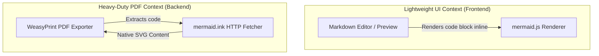
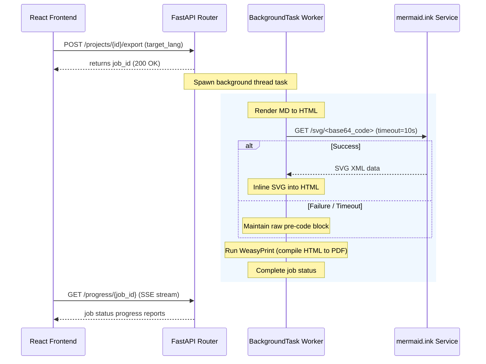

# Domain-Driven Design (DDD) Analysis Report - Mermaid Rendering Support

## 1. Bounded Contexts & Classifications

- **Lightweight UI Context (Frontend)**:
  - Responsible for Markdown editing and live document preview.
  - Customizes `MDEditor.Markdown` to render Mermaid diagrams interactively on the client side using the `mermaid` npm library.
  
- **Heavy-Duty Processing Context (Backend)**:
  - Responsible for generating print-ready documents (PDF compilation).
  - Handles parsing of code blocks and fetches rendered SVGs using an external rendering endpoint (`mermaid.ink`) with rate-limiting and fallback guards.

### Context Map (Mermaid Diagram)

---

## 2. Core Domain Entities & Attributes

We preserve the existing document aggregates (`Project`, `Segment`, `TranslationKey`). Fenced code blocks of type `mermaid` are not broken down into translatable segments, in order to preserve structural integrity (as mandated by standard Markdown parsing guidelines). They exist within the rebuilt document `markdown_content`.

---

## 3. Business Invariants & Constraints
- **Network Boundaries:**
  - PDF generation must not hang indefinitely if the external renderer is unreachable.
  - A timeout of **10.0 seconds** is enforced for HTTP fetch requests.
  - A fallback mechanism is mandatory: if the network request fails, return the raw textual `<pre><code>` representation of the chart.
- **Styling Bounds:**
  - All compiled SVGs must be styled with `max-width: 100%; height: auto` to prevent page overflow.
  - Diagrams must be structured to avoid page breaks mid-rendering (`page-break-inside: avoid`).

---

## 4. Execution & Offloading Strategy

### Sequence Flow (Mermaid Diagram)

