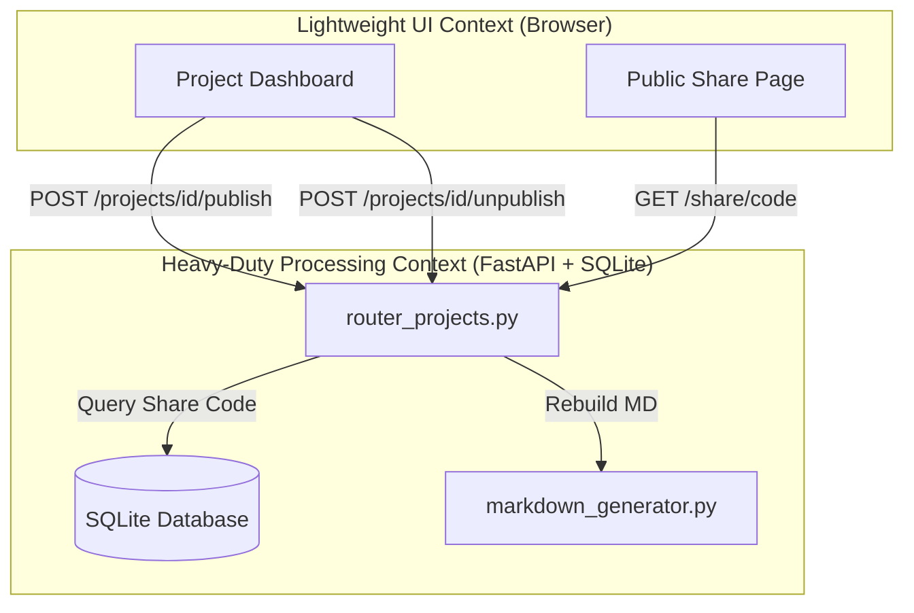
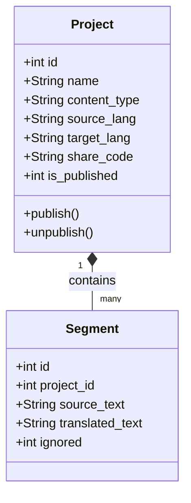
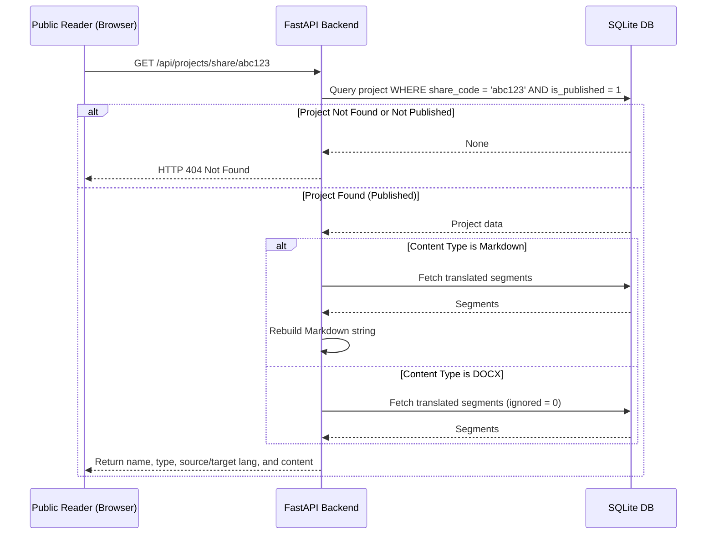

# Domain-Driven Design (DDD) Analysis Report - Document Publishing & Sharing

## 1. Bounded Contexts & Classifications
* **Lightweight UI Context (Frontend)**:
  * **Responsibility**: Displaying the read-only published page, copying the short link to the clipboard, toggling publish state on the project details dashboard.
  * **Classification**: Lightweight. Runs in the main browser thread.
* **Heavy-Duty Processing Context (Backend)**:
  * **Responsibility**: Generating the unique 6-character share code, performing database transactions to update publish status, rebuilding the translated markdown content.
  * **Classification**: Heavy-Duty. Rebuilding markdown performs regex replacement and DB lookups. SQLite handles transactional updates.

### Context Map (Mermaid Diagram)

---

## 2. Core Domain Entities & Attributes

* **Project (Aggregate Root)**:
  * Attributes:
    * `share_code`: Optional[str] (exactly 6 characters, alphanumeric, unique).
    * `is_published`: int (0 = unpublished, 1 = published).
  * Business Rules & Ownership:
    * Setting a project to "published" changes `is_published` to 1. If `share_code` is null, a new unique 6-character code is generated.
    * Setting a project to "unpublished" sets `is_published` to 0. The `share_code` can remain for reuse, or be cleared depending on preference (reusing it is standard to keep existing links consistent if republishing). Let's retain it so that republication uses the same code, unless requested otherwise.
    * When a project is deleted, its entry in `projects` (along with its segments) is deleted, freeing the `share_code`.

### Domain Model (Mermaid Diagram)

---

## 3. Business Invariants & Constraints
* **Uniqueness**: The `share_code` must be globally unique. If a generated code collides, the system must retry generating a new one (up to a reasonable limit, e.g., 5 attempts).
* **Length/Format**: The `share_code` must consist of exactly 6 characters matching `[a-zA-Z0-9]`.
* **Access Control**: A project's data can only be retrieved publicly via the share code if `is_published == 1`. Accessing an unpublished project or an invalid code must yield a 404 response.

---

## 4. Execution & Offloading Strategy
* Rebuilding markdown is a lightweight CPU task for standard files, but to avoid blocking, it is executed synchronously inside the request thread as it has negligible latency.
* The public endpoint `/api/projects/share/{share_code}` is registered under a custom route that bypasses `verify_session`.

### Sequence Flow (Mermaid Diagram)

