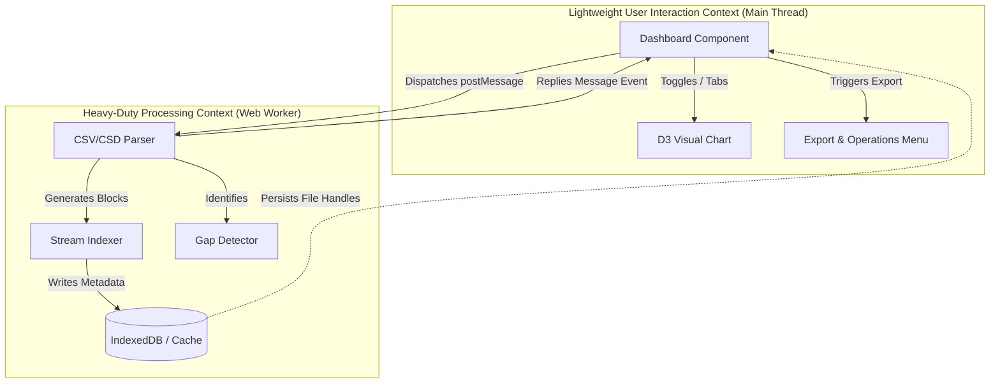
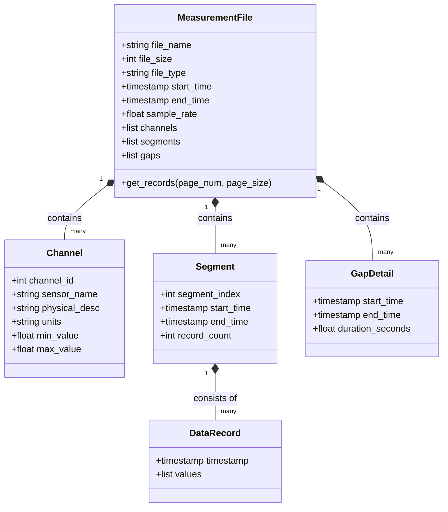

# Domain-Driven Design (DDD) Analysis Report - s4a-web

## Metadata
* **Creation Date:** 2026-06-22
* **Author:** Antigravity (Google DeepMind)
* **Version:** 1.0.0
* **Status:** Draft (Retroactive Analysis)

---

## 1. Context Decomposition

The `s4a-web` system is split into two primary Bounded Contexts to guarantee extreme performance and prevent main thread locks:

| Feature / Responsibility | Bounded Context | Target Environment |
| :--- | :--- | :--- |
| Component rendering, UI routing, & tab switching | Lightweight User Interaction | Browser Main Thread (React) |
| Active visual rendering & channel toggling | Lightweight User Interaction | SVG rendering (D3) |
| Local file handle persistence & index storage | Heavy-Duty Processing | Browser Main Thread & IndexedDB |
| Large CSV stream chunk indexing & byte offset generation | Heavy-Duty Processing | Web Worker Thread |
| Binary CSD headers parsing & channel data reading | Heavy-Duty Processing | Web Worker Thread |
| Analytical report computation (Consumption, Compressor analysis) | Heavy-Duty Processing | Web Worker / Utility Layer |
| Data Export & Gap Detection splitting | Heavy-Duty Processing | Web Worker / Utility Layer |

---

## 2. Domain Model Catalog

### Aggregate Roots
* **[MeasurementFile](file:///Users/ex/project/smallNfast/s4a-web/.agents/rules/10-domain-analysis.md#L25)**
  - Represents the main transactional boundary of a loaded sensor log file.
  - Manages the lifecycle of the data connection, handles data loading policies, and acts as the entry point for querying channel telemetry.

### Entities
* **[Channel](file:///Users/ex/project/smallNfast/s4a-web/.agents/rules/10-domain-analysis.md#L28)**
  - Represents an individual physical sensor stream within the file.
  - Identified by a unique `channel_id`.
  - Properties: physical measurement name, units, min/max statistics, resolution, and status.
* **[Segment](file:///Users/ex/project/smallNfast/s4a-web/.agents/rules/10-domain-analysis.md#L31)**
  - Represents a contiguous block of data records without chronological interruptions.
  - Identified by a unique segment sequence index and start/end timestamps.

### Value Objects
* **[DataRecord](file:///Users/ex/project/smallNfast/s4a-web/.agents/rules/10-domain-analysis.md#L33)**
  - Represents an immutable reading containing a precise timestamp and mapped sensor values.
* **[GapDetail](file:///Users/ex/project/smallNfast/s4a-web/.agents/rules/10-domain-analysis.md#L35)**
  - Represents an immutable range marking a chronological discontinuity (gap) in data logging.
  - Properties: `start_time`, `end_time`, `duration_seconds`.

---

## 3. Bounded Context Map

The relationship between Bounded Contexts follows a strict boundary, where data processing results are downstream from user inputs but upstream from component state.

---

## 4. Domain Model Relationships

The aggregate root and entities within the domain are mapped below:

---

## 5. Domain Invariants & Rules

1. **IndexedDB Sync Constraint:**
   - Any insertion or deletion of a persistent file handle in the `fileHandles` store must trigger a matching synchronization update in `localStorage.recentCsdFiles`.
2. **Chart Downsampling Rule:**
   - Visualizing time-series data must never pass more than 3000 points to the rendering layer. Strided sampling must occur at the data worker layer.
3. **Gap Detection Boundary:**
   - Chronological elapsed time between consecutive records exceeding `2.0 * sample_interval` constitutes a gap boundary, preventing automated interpolation.
4. **CSV Ingestion Boundary:**
   - Direct loading of files larger than 800MB is rejected in favor of an optimized conversion-to-CSD prompt.
