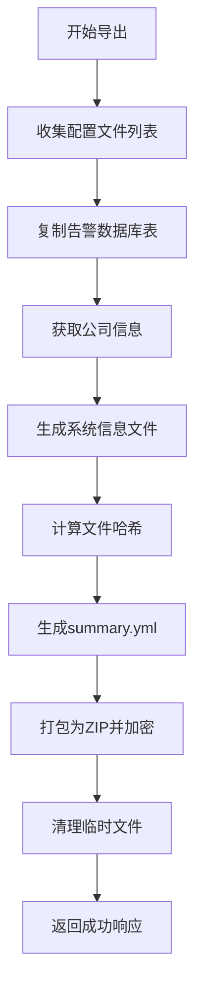
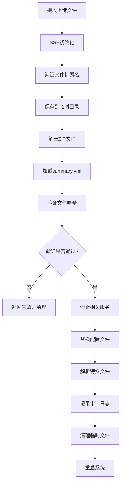

# 配置文件导出导入功能技术文档

## 目录

- [1. 概述](#1-概述)
- [2. 文件格式规范](#2-文件格式规范)
- [3. 导出功能原理](#3-导出功能原理)
- [4. 导入功能原理](#4-导入功能原理)
- [5. 安全机制](#5-安全机制)
- [6. 第三方集成指南](#6-第三方集成指南)
- [7. API 接口说明](#7-api-接口说明)
- [8. 故障排查](#8-故障排查)

---

## 1. 概述

### 1.1 应用场景

- 工厂生产线设备配置标准化
- 客户现场配置快速部署
- 系统升级前的配置备份
- 多站点设备的统一配置管理

### 1.2 核心特性

- **完整性校验**：使用 MD5 哈希算法确保文件未被篡改
- **密码保护**：ZIP 文件使用密码加密（默认密码：`SUTOXZCONFIG`）
- **实时反馈**：导入过程通过 SSE（Server-Sent Events）实时推送进度
- **审计日志**：所有配置变更操作都会记录审计事件
- **原子操作**：导入失败时自动回滚，保证系统稳定性

---

## 2. 文件格式规范

### 2.1 文件扩展名

配置文件包使用 `.cfgf` 扩展名（Config File Format），实际为加密的 ZIP 压缩包。

### 2.2 ZIP 文件结构

```
SUTO_config_YYYYMMDDHHmmss.cfgf (ZIP格式，密码: <zip-password>)
├── summary.yml                    # 配置摘要文件（必需）
├── config/
│   ├── SUTO-SensorList.sutolist  # 传感器列表配置
│   ├── cfgLocation.json          # 位置配置
│   ├── cfgOptionBoard.json       # 选项板配置
│   ├── cfgLayout.json            # 布局配置
│   ├── cfgGraphic.json           # 图形配置
│   ├── cfglogger.json            # 日志器配置
│   └── Alarm.db                  # 告警配置数据库
└── system/
    ├── backlight.json            # 自动锁屏配置
    ├── cfgcommunicatport.json    # 通信端口配置
    └── system_info.json          # 系统信息配置
```

### 2.3 summary.yml 文件结构

`summary.yml` 是配置包的核心元数据文件，包含以下字段：

```
version: "1.0.0"                    # 配置文件版本号
create_time: "2024-01-15 10:30:00"  # 创建时间（格式：YYYY-MM-DD HH:mm:ss）
hash: "a1b2c3d4e5f6..."             # SHA256 哈希值（所有配置文件的组合哈希）
reflect:                            # 文件映射关系
  "/config/SUTO-SensorList.sutolist": "/data/configs/sensorlist/SUTO-SensorList.sutolist"
  "/config/cfgLocation.json": "/data/configs/sensorlist/cfgLocation.json"
  "/config/cfgOptionBoard.json": "/data/configs/sensorlist/cfgOptionBoard.json"
  "/config/cfgLayout.json": "/data/configs/sensorlist/cfgLayout.json"
  "/config/cfgGraphic.json": "/data/configs/sensorlist/cfgGraphic.json"
  "/config/cfglogger.json": "/data/configs/logger/cfglogger.json"
  "/config/Alarm.db": "/data/Alarm.db"
  "/system/backlight.json": "/data/configs/system/autolock.json"
  "/system/cfgcommunicatport.json": "/data/configs/system/cfgcommunicatport.json"
  "/system/system_info.json": "parser.system_info"  # 特殊标记：需要解析处理
```

#### 字段说明

| 字段 | 类型 | 说明 |
|------|------|------|
| `version` | string | 配置文件格式版本，当前为 "1.0.0" |
| `create_time` | string | 配置包创建时间，ISO 8601 格式 |
| `hash` | string | SHA256 哈希值，用于完整性校验 |
| `reflect` | object | ZIP 内路径到目标系统路径的映射关系 |

#### 特殊标记说明

- **普通文件映射**：值为绝对路径，表示直接复制到该路径
- **`parser.*` 标记**：表示该文件需要特殊解析处理，不直接复制
  - `parser.system_info`：解析为系统信息和用户信息，分别更新到内存和数据库

### 2.4 文件命名规范

导出的配置文件包命名格式：
```
SUTO_config_YYYYMMDDHHmmss.cfgf
```

示例：`SUTO_config_20240115103045.cfgf`

---

## 3. 导出功能原理

### 3.1 整体流程



### 3.2 详细步骤

#### 步骤 1：定义文件映射关系

系统维护一个配置文件路径映射表，将源文件位置映射到 ZIP 包内的相对路径。该映射表在导出时用于收集需要打包的文件列表。

**映射表示例结构**：
- 键：源文件的绝对路径
- 值：ZIP 包内的相对路径（如 `/config/xxx.json`）

此映射关系确保了不同环境下配置文件的一致性，同时隐藏了实际的文件系统布局。

```Go
data := map[string]string{
    "/data/configs/sensorlist/SUTO-SensorList.sutolist": "/config/SUTO-SensorList.sutolist",
    "/data/configs/sensorlist/cfgOptionBoard.json":      "/config/cfgOptionBoard.json",
    // ... 其他文件映射
}
```

#### 步骤 2：复制告警数据库表

由于告警配置存储在 SQLite 数据库中，需要提取特定的数据表到临时位置。

**操作说明**：
- 从主数据库中提取告警相关的表结构和数据
- 复制到导出临时目录
- 使用专用的数据库表复制工具函数完成此操作

这样可以确保导出的配置文件包含完整的告警配置信息，同时保持数据库的完整性。

#### 步骤 3：获取公司信息

从系统数据库中读取服务公司相关信息，包括公司名称、地址、联系方式等基本信息。这些信息将嵌入到系统信息配置文件中，便于在不同设备间迁移时保持公司信息的一致性。

#### 步骤 4：生成系统信息文件

创建系统信息配置文件，该文件包含：
- **语言配置**：当前系统的语言设置和本地化 ID
- **用户信息配置**：服务公司相关信息（名称、地址、电话、邮箱、网站）

此文件在导入时会被特殊解析，分别更新到系统内存配置和数据库中。

#### 步骤 5：计算文件哈希

**⚠️ 关键：文件顺序一致性**

哈希计算的准确性完全依赖于**文件处理顺序的一致性**。导出和导入时必须使用**完全相同的文件顺序**，否则哈希值将不匹配。

**哈希计算方法**：

1. **构建文件列表**：**必须按照 ZIP 内路径的字母顺序排序**（这是最关键的一步）
2. **逐个计算文件 MD5**：对每个文件单独计算 MD5 哈希值
3. **组合哈希**：将所有文件的 MD5 哈希值（十六进制字符串）拼接后，再次计算 MD5
4. **转换为十六进制字符串**：存储到 `summary.yml` 的 `hash` 字段

**关键点**：
- ⚠️ **文件顺序必须固定且一致**：按 ZIP 内路径（相对路径）进行字母排序
- ⚠️ **严禁使用绝对路径排序**：不同环境下的绝对路径不同，会导致顺序不一致
- ⚠️ **排序必须在哈希计算前完成**：确保导出和导入使用相同的顺序
- 哈希计算必须在文件打包前完成
- 任何文件内容的变化都会导致哈希值改变
- 使用两级 MD5 计算：先计算单个文件的 MD5，再将这些 MD5 值拼接后计算最终的 MD5

**算法流程**：

```
第一步：收集所有文件的 ZIP 内路径（相对路径）
第二步：对路径列表进行字母排序（sort.Strings）
第三步：按排序后的顺序处理每个文件：
  对于每个文件 file_i:
    hash_i = MD5(file_i的内容)

第四步：最终哈希 = MD5(hash_1 + hash_2 + ... + hash_n)
```

其中 `+` 表示字符串拼接。

**为什么必须排序？**

如果不排序，以下情况会导致哈希校验失败：

| 场景 | 问题 | 后果 |
|------|------|------|
| Go map 遍历顺序不确定 | 每次导出的文件顺序可能不同 | 同一批文件生成不同的哈希值 |
| 不同操作系统文件系统差异 | 文件列表返回顺序不同 | 导出端和导入端顺序不一致 |
| 并发处理竞争条件 | 多个 goroutine 添加文件顺序不确定 | 哈希值不可重现 |

**正确做法示例**：

```Go
// ✅ 正确：对 ZIP 内路径进行排序
var zipPaths []string
for zipPath := range data {  // data 是路径映射表
    zipPaths = append(zipPaths, zipPath)  // 收集的是 ZIP 内相对路径
}
sort.Strings(zipPaths)  // 按字母顺序排序

// 然后按排序后的顺序处理文件
for _, zipPath := range zipPaths {
    srcPath := data[zipPath]  // 通过映射获取源文件路径
    // 计算该文件的 MD5...
}
```

**错误做法示例**：

```Go
// ❌ 错误：直接遍历映射表，顺序不确定
for zipPath, srcPath := range data {
    // 计算哈希...
}

// ❌ 错误：使用绝对路径排序（不同环境下路径不同）
var absPaths []string
for _, srcPath := range data {
    absPaths = append(absPaths, srcPath)  // 这是绝对路径
}
sort.Strings(absPaths)  // 在不同机器上排序结果可能不同
```

**实现细节**：

- **单文件哈希计算**：使用项目提供的工具函数
  - 缓冲区大小：默认 8KB，可配置
  - 分块读取文件，避免大文件占用过多内存
  - 返回 32 位十六进制字符串（MD5 标准输出格式）

- **组合哈希计算**：使用项目提供的组合哈希工具函数
  - **首先对文件路径列表进行排序**（这是函数的内部实现）
  - 遍历排序后的文件列表
  - 对每个文件调用单文件哈希函数获取其哈希值
  - 将每个文件的哈希值（字符串形式）写入最终的哈希计算器
  - 返回组合后的哈希值

**注意事项**：
- 这不是标准的"文件内容拼接后计算哈希"的方式
- 而是"先计算每个文件的哈希，再对这些哈希值进行二次哈希"
- 这种方式的优势是：
  - 可以验证单个文件的完整性
  - 便于增量校验（只需重新计算变化的文件）
  - 减少内存占用（不需要同时加载所有文件内容）
- ⚠️ **但前提是文件处理顺序必须完全一致**

#### 步骤 6：生成 `summary.yml`

创建摘要文件，包含：
- 版本号
- 创建时间
- 计算得到的哈希值
- 文件映射关系（`reflect` 字段）

#### 步骤 7：打包为 ZIP 并加密

使用 `utils.ZipFiles` 函数：
- **输入**：文件映射表、输出路径、密码
- **密码**：`<zip-password>`（需与系统配置的密码一致）
- **压缩算法**：标准 ZIP Deflate
- **加密方式**：ZIP 传统加密（ZipCrypto）

#### 步骤 8：清理临时文件

删除 `/data/export/configs/temp` 目录及其所有内容

### 3.3 关键技术点

#### 文件顺序一致性

为确保哈希值的可重复性，导出和导入时必须使用相同的文件顺序：

```go
// 对 ZIP 路径进行排序
var zipPaths []string
for zipPath := range data {
    zipPaths = append(zipPaths, zipPath)
}
sort.Strings(zipPaths)
```

#### 哈希计算实现

**核心算法伪代码**：

```Go
// 组合哈希计算函数（内部会自动排序）
func CalculateFileHash(files []string) (string, error) {
    finalHasher := md5.New()
    
    // 按文件路径排序（确保顺序一致）
    sort.Strings(files)
    
    for _, file := range files {
        // 第一步：计算单个文件的 MD5
        fileHash, err := CalculateMD5(file, bufferSize)
        if err != nil {
            return "", err
        }
        
        // 第二步：将文件的 MD5 字符串写入最终 hasher
        finalHasher.Write([]byte(fileHash))
    }
    
    // 第三步：计算所有文件 MD5 的组合 MD5
    return hex.EncodeToString(finalHasher.Sum(nil)), nil
}

// 单文件 MD5 计算（分块读取，默认 8KB 缓冲区）
func CalculateMD5(filePath string, bufferSize int) (string, error) {
    file, _ := os.Open(filePath)
    defer file.Close()
    
    hasher := md5.New()
    buffer := make([]byte, bufferSize)
    
    for {
        n, err := file.Read(buffer)
        if err == io.EOF {
            break
        }
        hasher.Write(buffer[:n])
    }
    
    return hex.EncodeToString(hasher.Sum(nil)), nil
}
```

**重要说明**：
- 系统使用的是 **MD5 算法**，而非 SHA256
- MD5 输出为 128 位（32 个十六进制字符）
- 虽然 MD5 在密码学上已被认为不够安全，但对于配置文件完整性校验已足够
- 如果未来需要更高的安全性，可以升级到 SHA256，但需要重新生成所有配置包

---

## 4. 导入功能原理

### 4.1 整体流程



### 4.2 SSE 实时推送机制

#### 为什么需要 SSE？

导入过程涉及多个耗时操作（文件解压、服务停止、系统重启等），使用 SSE 可以：
- 实时向前端推送进度
- 提供更好的用户体验
- 便于故障定位和问题排查

#### SSE 实现要点

**1. 设置响应头**

```Go
c.Header("content-type", "text/event-stream")
c.Header("cache-control", "no-cache")
c.Header("connection", "keep-alive")
```

**2. 获取 Flusher**

```go
flusher, ok := c.Writer.(http.Flusher)
if !ok {
    log.Println("Streaming not supported")
    return
}
```

**3. 发送事件并刷新**

```go
pushMessage := func(c *gin.Context, op string, target string, status string) {
    c.SSEvent(op, gin.H{
        "target": target,
        "status": status,
    })
    flusher.Flush() // 关键：强制刷新缓冲区
}
```

**4. 事件类型说明**

| 事件类型 (op) | 目标 (target) | 状态 (status) | 说明 |
|--------------|--------------|--------------|------|
| `authorization` | Token Check | Success/Failed | 令牌验证结果 |
| `upload` | File get | Success/Failed | 文件上传状态 |
| `upload` | File check | Success/Failed | 文件扩展名验证 |
| `save file` | Temp path create | Success/Failed | 临时目录创建 |
| `save file` | File save to temp path | Success/Failed | 文件保存状态 |
| `extract` | File extract | Success/Failed | 文件解压状态 |
| `verify` | Summary check | Success/Failed | 摘要文件验证 |
| `verify` | File hash check | Success/Failed | 哈希校验结果 |
| `close service` | Alarm close | Success/Failed | 告警服务停止 |
| `close service` | Logger close | Success/Failed | 日志服务停止 |
| `close service` | Measurement close | Success/Failed | 测量服务停止 |
| `import` | System info check | Success/Failed | 系统信息解析 |
| `save` | System config save | Success/Failed | 系统配置保存 |
| `save` | Service company info save | Success/Failed | 公司信息保存 |
| `import` | File import : from X to Y | Success/Failed | 文件复制状态 |
| `clean` | Clean temp directory | Success/Failed | 临时文件清理 |
| `restart` | Restart machine | Success/Failed | 系统重启 |

#### 前端接收示例

```
const eventSource = new EventSource('/api/import-configs');

eventSource.addEventListener('upload', (event) => {
    const data = JSON.parse(event.data);
    console.log(`上传状态: ${data.target} - ${data.status}`);
});

eventSource.addEventListener('verify', (event) => {
    const data = JSON.parse(event.data);
    console.log(`验证状态: ${data.target} - ${data.status}`);
});

eventSource.addEventListener('error', (event) => {
    console.error('SSE 连接错误');
    eventSource.close();
});
```

### 4.3 详细导入步骤

#### 步骤 1：身份验证

从 Gin 上下文获取用户 ID：
- 检查 `user_id` 是否存在
- 验证用户类型为整数
- 查询数据库确认用户存在且状态为 `ENABLED`

失败时推送：`{"op": "authorization", "target": "Token Check", "status": "Failed"}`

#### 步骤 2：接收上传文件

从表单数据中获取文件：
- 表单字段名：`config_file`
- 验证文件扩展名必须为 `.cfgf`

#### 步骤 3：创建临时目录

- **临时目录路径**：`/data/temp`
- **权限**：`0755`
- 如果目录已存在，`MkdirAll` 不会报错

#### 步骤 4：保存上传文件

将上传的文件保存到临时目录：
- 文件路径：`/data/temp/<原始文件名>`
- 使用 `c.SaveUploadedFile` 方法

#### 步骤 5：解压 ZIP 文件

- **解压目标**：`/data/temp/extracted`
- **密码**：`<zip-password>`
- 使用 `utils.UnzipFiles` 函数
- 解压失败时自动清理临时目录

#### 步骤 6：加载并验证 summary.yml

从解压目录加载 `summary.yml` 文件：
- 解析 YAML 格式
- 验证必需字段存在（`version`、`hash`、`reflect`）
- 失败时推送错误并清理临时文件

#### 步骤 7：验证文件哈希

**验证流程**：

1. **收集文件列表**：
   - 遍历 `reflect` 映射的所有键（ZIP 内路径）
   - 跳过以 `parser.` 开头的特殊标记
   - 对路径进行字母排序

2. **构建完整路径**：
   - 将 ZIP 内路径与解压目录拼接
   - 例如：`/data/temp/extracted/config/Alarm.db`

3. **计算哈希**：
   - 使用与导出时相同的算法
   - 按相同顺序读取文件内容
   - 计算 SHA256 哈希值

4. **对比哈希**：
   - 将计算得到的哈希与 `summary.yml` 中的哈希对比
   - 不一致则判定为文件被篡改或损坏

**安全性**：
- 哈希校验防止中间人攻击
- 确保配置文件完整性
- 任何字节的变化都会导致校验失败

#### 步骤 8：停止相关服务

在替换配置文件前，必须停止依赖这些配置的服务：

```bash
killall alarm      # 停止告警服务
killall logger     # 停止日志服务
killall mea        # 停止测量服务
```

**注意事项**：
- 即使某个服务不存在（`killall` 返回错误），也继续执行
- 服务停止失败不影响后续流程，但会记录日志

#### 步骤 9：替换配置文件

遍历 `reflect` 映射，根据目标路径类型采取不同策略：

##### 9.1 普通文件复制

对于大多数配置文件，直接使用文件复制工具将解压后的文件复制到目标位置。系统会自动处理目录创建和权限设置。

##### 9.2 特殊文件解析（parser.* 标记）

某些配置文件需要特殊处理，不直接复制：

**system_info.json 的处理流程**：

1. **加载文件**：解析 JSON 格式的系统信息文件
2. **更新语言配置**：将语言设置应用到系统全局配置
3. **更新公司信息**：将服务公司信息更新到数据库

这种设计允许在配置包中嵌入需要解析处理的元数据，而不是简单的文件复制。

#### 步骤 10：记录审计日志

异步发送两个审计事件：

**审计事件 1：告警配置变更**

- **DataBefore**：固定字符串 `"Config alarm imported-1"`
- **DataAfter**：格式化后的告警配置详情
  - 传感器描述
  - 通道描述
  - 位置
  - 测量点
  - 单位
  - 阈值
  - 方向（up/down）
  - 迟滞
  - 延迟
  - 继电器地址和通道

**审计事件 2：传感器配置变更**

- **DataBefore**：固定字符串 `"Config alarm imported-2"`
- **DataAfter**：格式化后的传感器和通道列表

**审计事件结构**：

审计事件包含以下字段：
- **Timestamp**：操作时间戳（Unix 时间）
- **UserID**：操作用户 ID
- **Account**：用户名
- **AccountType**：用户类型
- **OperateObject**：操作对象类型
- **OperationType**：操作类型（如导入、导出等）
- **DataBefore**：操作前的数据快照
- **DataAfter**：操作后的数据快照
- **ClientIP**：客户端 IP 地址
- **UserAgent**：用户代理信息

此结构确保了完整的审计追踪能力，符合安全合规要求。

#### 步骤 11：清理临时文件

删除整个临时工作目录及其所有内容，确保不留存任何中间文件。系统使用专用的文件清理工具函数完成此操作，即使部分文件被占用也能最大程度清理。

#### 步骤 12：重启系统

等待短暂延迟后执行系统重启命令。

**注意**：
- 重启命令执行后，HTTP 连接会立即中断
- 前端应监听连接断开事件，提示用户系统正在重启
- 建议前端在收到重启信号后显示倒计时页面，告知用户系统将在指定时间后恢复服务

### 4.4 错误处理策略

#### 失败时的清理

在任何步骤失败时：
1. 推送失败状态到前端
2. 调用 `utils.DeletePath(tempDir)` 清理临时文件
3. 记录错误日志
4. 终止后续操作

#### 部分成功的处理

- 如果服务停止失败但文件复制成功：继续执行，记录警告
- 如果审计日志发送失败：仅记录日志，不影响主流程
- 如果清理临时文件失败：记录警告，但不影响最终结果

---

## 5. 安全机制

### 5.1 完整性校验

#### 哈希校验

- **算法**：MD5（两级哈希）
- **计算方式**：
  1. **⚠️ 首先对文件列表按 ZIP 内路径进行字母排序**（关键步骤）
  2. 对每个配置文件单独计算 MD5 哈希值
  3. 将所有文件的 MD5 哈希值（十六进制字符串）按排序后的顺序拼接
  4. 对拼接后的字符串再次计算 MD5，得到最终哈希值
- **范围**：所有配置文件的内容
- **时机**：导入时重新计算并与摘要文件对比
- **作用**：检测文件篡改、传输错误、存储损坏
- **缓冲区大小**：8KB（分块读取，优化大文件处理）
- **排序依据**：ZIP 内相对路径（如 `/config/Alarm.db`），而非源文件绝对路径

#### 为什么必须排序？

如果不排序，以下情况会导致哈希校验失败：

| 场景 | 问题 | 后果 |
|------|------|------|
| Go map 遍历顺序不确定 | 每次导出的文件顺序可能不同 | 同一批文件生成不同的哈希值 |
| 不同操作系统文件系统差异 | 文件列表返回顺序不同 | 导出端和导入端顺序不一致 |
| 并发处理竞争条件 | 多个 goroutine 添加文件顺序不确定 | 哈希值不可重现 |
| 使用绝对路径排序 | 不同环境下路径前缀不同 | 排序结果不同，哈希值不匹配 |

#### 为什么使用两级 MD5？

相比直接拼接文件内容后计算哈希，两级 MD5 有以下优势：

1. **内存效率**：不需要同时加载所有文件到内存
2. **增量验证**：可以单独验证某个文件是否被修改
3. **可追溯性**：每个文件都有独立的 MD5，便于定位问题
4. **性能优化**：大文件可以分块读取，避免内存溢出

#### 校验失败的处理

- 立即终止导入流程
- 清理所有临时文件
- 向前端推送失败状态
- 记录详细的错误日志（期望哈希 vs 实际哈希）

### 5.2 密码保护

- **ZIP 密码**：`<zip-password>`
- **加密方式**：ZIP 传统加密（ZipCrypto）
- **目的**：防止未经授权的访问和意外修改
- **限制**：ZipCrypto 安全性较弱，适合防君子不防小人

### 5.3 权限控制

#### 身份验证

- 所有导入请求必须携带有效的 JWT 令牌
- 令牌通过 HTTP Header 或 URL 参数传递
- 中间件验证令牌有效性并提取用户 ID

#### 用户状态检查

- 验证用户存在于数据库中
- 检查用户状态为 `ENABLED`
- 失败时拒绝操作并记录日志

### 5.4 审计追踪

所有配置导入操作都会记录：
- 操作用户 ID 和用户名
- 用户类型
- 操作时间戳
- 客户端 IP 地址
- 用户代理（浏览器/工具信息）
- 配置变更前后的数据快照

### 5.5 原子性保证

虽然无法完全实现事务性操作，但通过以下措施降低风险：

1. **先验证后操作**：哈希校验通过后才开始替换文件
2. **服务停止**：替换前停止相关服务，避免读写冲突
3. **临时目录隔离**：所有操作在临时目录进行，成功后才覆盖
4. **失败回滚**：任何步骤失败都清理临时文件，保持原状

---

## 6. 第三方集成指南

### 6.1 生成兼容的配置文件包

如果你需要开发第三方工具来生成 `.cfgf` 文件，请遵循以下步骤：

#### 步骤 1：准备配置文件

收集所有必需的配置文件：

| 文件路径 | 说明 | 必需 |
|---------|------|------|
| `SUTO-SensorList.sutolist` | 传感器列表配置 | 是 |
| `cfgLocation.json` | 位置配置 | 是 |
| `cfgOptionBoard.json` | 选项板配置 | 是 |
| `cfgLayout.json` | 布局配置 | 是 |
| `cfgGraphic.json` | 图形配置 | 是 |
| `cfglogger.json` | 日志器配置 | 是 |
| `Alarm.db` | 告警配置数据库 | 是 |
| `backlight.json` | 自动锁屏配置 | 是 |
| `cfgcommunicatport.json` | 通信端口配置 | 是 |
| `system_info.json` | 系统信息配置 | 是 |

#### 步骤 2：创建目录结构

```bash
temp_export/
├── config/
│   ├── SUTO-SensorList.sutolist
│   ├── cfgLocation.json
│   ├── cfgOptionBoard.json
│   ├── cfgLayout.json
│   ├── cfgGraphic.json
│   ├── cfglogger.json
│   └── Alarm.db
├── system/
│   ├── backlight.json
│   ├── cfgcommunicatport.json
│   └── system_info.json
```

#### 步骤 3：计算文件哈希

**Python 示例**：

```Python
import hashlib
import os

def calculate_md5(file_path, buffer_size=8192):
    """计算单个文件的 MD5 哈希值"""
    md5_hash = hashlib.md5()
    
    with open(file_path, 'rb') as f:
        while True:
            chunk = f.read(buffer_size)
            if not chunk:
                break
            md5_hash.update(chunk)
    
    return md5_hash.hexdigest()

def calculate_file_hash(file_list):
    """
    计算文件列表的组合 MD5 哈希
    采用两级 MD5：先计算每个文件的 MD5，再对这些 MD5 值进行二次 MD5
    
    ⚠️ 重要：file_list 必须是已经按路径排序的列表
    """
    final_hasher = hashlib.md5()
    
    # ⚠️ 关键步骤：按文件路径排序，确保一致性
    sorted_files = sorted(file_list)
    
    for file_path in sorted_files:
        # 第一步：计算单个文件的 MD5
        file_md5 = calculate_md5(file_path)
        
        # 第二步：将文件的 MD5 字符串（十六进制）写入最终 hasher
        final_hasher.update(file_md5.encode('utf-8'))
    
    # 第三步：返回组合后的 MD5
    return final_hasher.hexdigest()

# ✅ 正确使用示例
files = [
    'temp_export/config/SUTO-SensorList.sutolist',
    'temp_export/config/cfgLocation.json',
    'temp_export/config/cfgOptionBoard.json',
    # ... 其他文件
]
# 注意：calculate_file_hash 内部会自动排序，但传入时最好也保持有序

hash_value = calculate_file_hash(files)
print(f"Hash: {hash_value}")

# ❌ 错误使用示例：每次调用时文件顺序不同
import random
random.shuffle(files)  # 打乱顺序
hash_value_wrong = calculate_file_hash(files)  # 结果与上面相同（因为内部会排序）
```

**Go 示例**：

```Go
package main

import (
    "crypto/md5"
    "encoding/hex"
    "fmt"
    "io"
    "os"
    "sort"
)

const DefaultBufferSize = 8 * 1024

// CalculateMD5 计算单个文件的 MD5 哈希值
func CalculateMD5(filePath string, bufferSize int) (string, error) {
    file, err := os.Open(filePath)
    if err != nil {
        return "", err
    }
    defer file.Close()
    
    if bufferSize <= 0 {
        bufferSize = DefaultBufferSize
    }
    
    hasher := md5.New()
    buffer := make([]byte, bufferSize)
    
    for {
        n, err := file.Read(buffer)
        if err == io.EOF {
            break
        }
        if err != nil {
            return "", err
        }
        hasher.Write(buffer[:n])
    }
    
    return hex.EncodeToString(hasher.Sum(nil)), nil
}

// CalculateFileHash 计算文件列表的组合 MD5 哈希
// ⚠️ 重要：函数内部会对文件列表进行排序，确保顺序一致性
func CalculateFileHash(files []string) (string, error) {
    if len(files) == 0 {
        return "", fmt.Errorf("file list cannot be empty")
    }
    
    finalHasher := md5.New()
    
    // ⚠️ 关键步骤：排序文件列表，确保顺序一致
    sort.Strings(files)
    
    for _, file := range files {
        // 第一步：计算单个文件的 MD5
        fileHash, err := CalculateMD5(file, DefaultBufferSize)
        if err != nil {
            return "", fmt.Errorf("failed to calculate hash for file '%s': %w", file, err)
        }
        
        // 第二步：将文件的 MD5 字符串写入最终 hasher
        finalHasher.Write([]byte(fileHash))
    }
    
    // 第三步：返回组合后的 MD5
    return hex.EncodeToString(finalHasher.Sum(nil)), nil
}

// ✅ 正确用法：从映射表中提取路径后排序
func ExportConfigsExample() {
    // 假设的路径映射表（键为源文件路径，值为 ZIP 内相对路径）
    data := map[string]string{
        "/path/to/source/file1.json": "/config/file1.json",
        "/path/to/source/file2.db":   "/config/file2.db",
        // ... 其他文件
    }
    
    // 第一步：收集 ZIP 内路径（相对路径）
    var zipPaths []string
    for zipPath := range data {
        zipPaths = append(zipPaths, zipPath)
    }
    
    // ⚠️ 第二步：对 ZIP 内路径排序（不是源文件路径！）
    sort.Strings(zipPaths)
    
    // 第三步：按排序后的顺序构建源文件列表
    var sourceFiles []string
    pathMap := make(map[string]string)
    for srcPath, zipPath := range data {
        pathMap[zipPath] = srcPath
    }
    for _, zipPath := range zipPaths {
        if srcPath, exists := pathMap[zipPath]; exists {
            sourceFiles = append(sourceFiles, srcPath)
        }
    }
    
    // 第四步：计算哈希（CalculateFileHash 内部还会再次排序，确保万无一失）
    hash, err := CalculateFileHash(sourceFiles)
    if err != nil {
        log.Fatal(err)
    }
    fmt.Printf("Hash: %s\n", hash)
}

// ⚠️ 常见错误**：

// ❌ 错误 1：直接遍历映射表，不排序
func WrongApproach1() {
    data := map[string]string{
        "/path/to/file1.txt": "/config/file1.txt",
        "/path/to/file2.txt": "/config/file2.txt",
    }
    
    var files []string
    for srcPath := range data {  // Go map 遍历顺序不确定！
        files = append(files, srcPath)
    }
    // 每次运行 files 的顺序可能不同，导致哈希值不一致
    hash, _ := CalculateFileHash(files)
}

// ❌ 错误 2：使用绝对路径排序
func WrongApproach2() {
    data := map[string]string{
        "/path/to/configs/file1.json": "/config/file1.json",
        "/path/to/data/file2.db":      "/config/file2.db",
    }
    
    var absPaths []string
    for srcPath := range data {
        absPaths = append(absPaths, srcPath)  // 收集的是绝对路径
    }
    sort.Strings(absPaths)  // 在不同机器上，如果路径前缀不同，排序结果会不同
    
    // 例如：
    // 机器 A: ["/path/to/data/file2.db", "/path/to/configs/..."] 
    // 机器 B: ["/mnt/path/to/data/file2.db", "/mnt/path/to/configs/..."]
    // 排序结果可能不同！
}

// ✅ 正确做法：使用 ZIP 内路径（相对路径）排序
func CorrectApproach() {
    data := map[string]string{
        "/path/to/configs/file1.json": "/config/file1.json",
        "/path/to/data/file2.db":      "/config/file2.db",
    }
    
    // 收集 ZIP 内路径（相对路径）
    var zipPaths []string
    for zipPath := range data {
        zipPaths = append(zipPaths, zipPath)
    }
    sort.Strings(zipPaths)  // 相对路径在所有环境中都相同
    
    // 按排序后的 ZIP 路径映射回源文件
    pathMap := make(map[string]string)
    for srcPath, zipPath := range data {
        pathMap[zipPath] = srcPath
    }
    
    var sourceFiles []string
    for _, zipPath := range zipPaths {
        sourceFiles = append(sourceFiles, pathMap[zipPath])
    }
    
    hash, _ := CalculateFileHash(sourceFiles)
}
```

#### 步骤 4：生成 summary.yml

**YAML 格式示例**：

```bash
version: "1.0.0"
create_time: "2024-01-15 10:30:00"
hash: "<calculated-hash-value>"
reflect:
  "/config/SUTO-SensorList.sutolist": "<target-path-for-sensor-list>"
  "/config/cfgLocation.json": "<target-path-for-location-config>"
  "/config/cfgOptionBoard.json": "<target-path-for-optionboard-config>"
  "/config/cfgLayout.json": "<target-path-for-layout-config>"
  "/config/cfgGraphic.json": "<target-path-for-graphic-config>"
  "/config/cfglogger.json": "<target-path-for-logger-config>"
  "/config/Alarm.db": "<target-path-for-alarm-database>"
  "/system/backlight.json": "<target-path-for-backlight-config>"
  "/system/cfgcommunicatport.json": "<target-path-for-commport-config>"
  "/system/system_info.json": "parser.system_info"
```

**字段说明**：
- `hash`：通过步骤 3 计算得到的哈希值
- `reflect`：ZIP 内路径到目标系统路径的映射
- 值为 `parser.*` 的条目表示需要特殊解析处理，不直接复制

**Python 生成示例**：

```Python
import yaml
from datetime import datetime

summary = {
    "version": "1.0.0",
    "create_time": datetime.now().strftime("%Y-%m-%d %H:%M:%S"),
    "hash": hash_value,  # 上一步计算的哈希值
    "reflect": {
        "/config/SUTO-SensorList.sutolist": "<target-path-for-sensor-list>",
        "/config/cfgLocation.json": "<target-path-for-location-config>",
        "/config/cfgOptionBoard.json": "<target-path-for-optionboard-config>",
        "/config/cfgLayout.json": "<target-path-for-layout-config>",
        "/config/cfgGraphic.json": "<target-path-for-graphic-config>",
        "/config/cfglogger.json": "<target-path-for-logger-config>",
        "/config/Alarm.db": "<target-path-for-alarm-database>",
        "/system/backlight.json": "<target-path-for-backlight-config>",
        "/system/cfgcommunicatport.json": "<target-path-for-commport-config>",
        "/system/system_info.json": "parser.system_info"
    }
}

with open('temp_export/summary.yml', 'w', encoding='utf-8') as f:
    yaml.dump(summary, f, allow_unicode=True, default_flow_style=False)
```

**注意事项**：
- `hash_value` 是步骤 3 中计算得到的哈希字符串
- 目标路径应与系统实际的文件布局一致
- `parser.system_info` 是特殊标记，表示该文件需要解析处理

#### 步骤 5：打包为 ZIP 并加密

**Python 示例**（使用 `pyminizip` 库）：

```Python
import pyminizip
import os

# 安装: pip install pyminizip

compression_level = 5  # 压缩级别 1-9
password = "<zip-password>"  # ZIP 加密密码

# 准备文件列表
files = []
for root, dirs, filenames in os.walk('temp_export'):
    for filename in filenames:
        file_path = os.path.join(root, filename)
        arcname = os.path.relpath(file_path, 'temp_export')
        files.append((file_path, arcname))

# 创建加密 ZIP
output_file = "SUTO_config_20240115103000.cfgf"
pyminizip.compress_multiple(
    [f[0] for f in files],  # 文件路径列表
    [f[1] for f in files],  # ZIP 内路径列表
    output_file,
    password,
    compression_level
)

print(f"配置文件包已生成: {output_file}")
```

**Go 示例**（使用 `github.com/alexmullins/zip` 库）：

```Go
package main

import (
    "github.com/alexmullins/zip"
    "io/ioutil"
    "os"
    "path/filepath"
)

func CreateEncryptedZip(sourceDir, outputFile, password string) error {
    zipFile, err := os.Create(outputFile)
    if err != nil {
        return err
    }
    defer zipFile.Close()
    
    zipWriter := zip.NewWriter(zipFile)
    defer zipWriter.Close()
    
    // 遍历目录
    return filepath.Walk(sourceDir, func(path string, info os.FileInfo, err error) error {
        if err != nil {
            return err
        }
        
        if info.IsDir() {
            return nil
        }
        
        relPath, _ := filepath.Rel(sourceDir, path)
        
        // 创建 ZIP 条目并设置密码
        header := &zip.FileHeader{
            Name:   relPath,
            Method: zip.Deflate,
        }
        header.SetPassword(password)
        
        writer, err := zipWriter.CreateHeader(header)
        if err != nil {
            return err
        }
        
        content, _ := ioutil.ReadFile(path)
        _, err = writer.Write(content)
        return err
    })
}
```

#### 步骤 6：验证生成的文件

使用系统提供的导出功能生成一个标准的 `.cfgf` 文件，然后：
1. 解压两个文件
2. 对比 `summary.yml` 的结构
3. 验证哈希计算方法是否正确
4. 测试导入功能

### 6.2 system_info.json 格式

如果需要自定义系统信息，`system_info.json` 必须符合以下结构：

```json
{
  "language_config": {
    "local_id": 1,
    "language": "zh-CN"
  },
  "user_info_config": {
    "service_company_name": "公司名称",
    "address": "公司地址",
    "telephone": "联系电话",
    "email": "联系邮箱",
    "website": "公司网站"
  }
}
```

**字段说明**：

| 字段 | 类型 | 说明 | 示例 |
|------|------|------|------|
| `language_config.local_id` | int | 语言 ID | 1=中文, 2=英文 |
| `language_config.language` | string | 语言代码 | "zh-CN", "en-US" |
| `user_info_config.service_company_name` | string | 服务公司名称 | "某某科技有限公司" |
| `user_info_config.address` | string | 地址 | "北京市朝阳区xxx路xxx号" |
| `user_info_config.telephone` | string | 电话 | "010-12345678" |
| `user_info_config.email` | string | 邮箱 | "contact@example.com" |
| `user_info_config.website` | string | 网站 | "www.example.com" |

### 6.3 Alarm.db 数据库结构

告警配置存储在 SQLite 数据库中，包含三个表：

#### alarm_config 表

| 字段 | 类型 | 说明 |
|------|------|------|
| id | INTEGER | 主键 |
| sensor_id | INTEGER | 传感器 ID |
| channel_id | INTEGER | 通道 ID |
| threshold | REAL | 阈值 |
| direction | INTEGER | 方向（1=向上, 0=向下） |
| hysteresis | REAL | 迟滞值 |
| delay | INTEGER | 延迟时间（秒） |
| relay_address | INTEGER | 继电器地址 |
| relay_ch | INTEGER | 继电器通道 |

#### sensor 表

| 字段 | 类型 | 说明 |
|------|------|------|
| id | INTEGER | 主键 |
| description | TEXT | 传感器描述 |
| location | TEXT | 位置 |
| meapoint | TEXT | 测量点 |

#### channel 表

| 字段 | 类型 | 说明 |
|------|------|------|
| id | INTEGER | 主键 |
| sensor_id | INTEGER | 所属传感器 ID |
| channel_id | INTEGER | 通道 ID |
| description | TEXT | 通道描述 |
| unit | TEXT | 单位 |

**注意**：建议使用 SQLite 工具（如 `sqlite3` 命令行或 DB Browser for SQLite）来操作数据库。

### 6.4 测试验证

#### 本地测试步骤

1. **生成测试配置文件包**
   ```bash
   python generate_config.py  # 你的生成脚本
   ```

2. **验证 ZIP 结构**
   ```bash
   unzip -l SUTO_config_test.cfgf
   ```

3. **测试解压**
   ```bash
   mkdir test_extract
   cd test_extract
   unzip -P <zip-password> ../SUTO_config_test.cfgf
   ```

4. **验证 summary.yml**
   ```bash
   cat summary.yml
   ```

5. **手动计算哈希并对比**
   ```bash
   python verify_hash.py  # 你的验证脚本
   ```

6. **在实际系统中测试导入**
   - 通过 Web 界面上传文件
   - 观察 SSE 推送的每个步骤
   - 检查日志确认无错误

#### 常见问题

| 问题 | 可能原因 | 解决方案 |
|------|---------|---------|
| 哈希校验失败 | 文件顺序不一致 | 确保按 ZIP 路径字母排序 |
| 哈希校验失败 | 文件内容有差异 | 检查文件编码（UTF-8）、换行符（LF vs CRLF） |
| 解压失败 | 密码错误 | 确认密码为 `SUTOXZCONFIG`（区分大小写） |
| 解压失败 | ZIP 格式不支持 | 使用标准 ZIP 加密，不要用 AES 加密 |
| 导入后配置未生效 | 服务未重启 | 确认系统已执行重启命令 |
| system_info 未更新 | JSON 格式错误 | 验证 JSON 语法，确保字段名正确 |

---

## 7. API 接口说明

### 7.1 导出配置

**接口地址**：`POST /api/export-configs`

**请求参数**：无

**响应格式**：

```json
{
  "code": 200,
  "status": true,
  "message": "Success to export configs"
}
```

**生成的文件**：系统会在配置的导出目录生成配置文件包，文件名包含时间戳以便区分不同版本的配置。

**注意事项**：
- 导出完成后，文件保存在服务器指定目录
- 需要通过其他方式（如文件下载接口）获取文件
- 临时文件会自动清理，无需手动干预

### 7.2 导入配置

**接口地址**：`POST /api/import-configs`

**请求类型**：`multipart/form-data`

**请求参数**：

| 参数名 | 类型 | 必需 | 说明 |
|--------|------|------|------|
| config_file | File | 是 | 配置文件包（.cfgf 格式） |

**认证要求**：
- 需要在请求头中包含 JWT 令牌
- Header: `Authorization: Bearer <token>`
- 或者 URL 参数: `?token=<token>`

**响应类型**：`text/event-stream`（SSE）

**响应示例**：

```json
event: upload
data: {"target":"File get","status":"Success"}

event: upload
data: {"target":"File check","status":"Success"}

event: save file
data: {"target":"Temp path create","status":"Success"}

event: save file
data: {"target":"File save to temp path","status":"Success"}

event: extract
data: {"target":"File extract","status":"Success"}

event: verify
data: {"target":"Summary check","status":"Success"}

event: verify
data: {"target":"File hash check","status":"Success"}

event: close service
data: {"target":"Alarm close","status":"Success"}

event: close service
data: {"target":"Logger close","status":"Success"}

event: close service
data: {"target":"Measurement close","status":"Success"}

event: import
data: {"target":"System info check","status":"Success"}

event: save
data: {"target":"System config save","status":"Success"}

event: save
data: {"target":"Service company info save","status":"Success"}

event: import
data: {"target":"File import : from /data/temp/extracted/config/Alarm.db to /data/Alarm.db","status":"Success"}

event: clean
data: {"target":"Clean temp directory","status":"Success"}

event: restart
data: {"target":"Restart machine","status":"Success"}
```

**错误响应示例**：

```json
event: authorization
data: {"target":"Token Check","status":"Failed"}

event: upload
data: {"target":"File check","status":"Failed"}

event: verify
data: {"target":"File hash check","status":"Failed"}
```

**前端调用示例**：

```javascript
function importConfig(file) {
    const formData = new FormData();
    formData.append('config_file', file);
    
    // 获取 token（从 localStorage 或其他地方）
    const token = localStorage.getItem('auth_token');
    
    const eventSource = new EventSource(`/api/import-configs?token=${token}`);
    
    eventSource.addEventListener('upload', handleEvent);
    eventSource.addEventListener('save file', handleEvent);
    eventSource.addEventListener('extract', handleEvent);
    eventSource.addEventListener('verify', handleEvent);
    eventSource.addEventListener('close service', handleEvent);
    eventSource.addEventListener('import', handleEvent);
    eventSource.addEventListener('save', handleEvent);
    eventSource.addEventListener('clean', handleEvent);
    eventSource.addEventListener('restart', handleEvent);
    
    eventSource.addEventListener('error', (event) => {
        console.error('SSE 连接错误:', event);
        eventSource.close();
    });
    
    function handleEvent(event) {
        const data = JSON.parse(event.data);
        console.log(`${event.type}: ${data.target} - ${data.status}`);
        
        // 更新 UI 显示进度
        updateProgressUI(event.type, data.target, data.status);
        
        // 如果收到重启信号，显示倒计时页面
        if (event.type === 'restart' && data.status === 'Success') {
            showRebootCountdown();
        }
        
        // 如果任何步骤失败，关闭连接并显示错误
        if (data.status === 'Failed') {
            showError(`${data.target} 失败`);
            eventSource.close();
        }
    }
}

// 文件选择触发
document.getElementById('configFileInput').addEventListener('change', (e) => {
    const file = e.target.files[0];
    if (file && file.name.endsWith('.cfgf')) {
        importConfig(file);
    } else {
        alert('请选择 .cfgf 格式的配置文件');
    }
});
```

**后端调用示例**（curl）：

```bash
curl -X POST http://<server-ip>/api/import-configs \
  -H "Authorization: Bearer <jwt-token>" \
  -F "config_file=@SUTO_config_20240115103000.cfgf" \
  --no-buffer
```

**参数说明**：
- `<server-ip>`：服务器 IP 地址或域名
- `<jwt-token>`：有效的 JWT 认证令牌
- `--no-buffer`：确保 curl 实时显示 SSE 事件，不使用缓冲

**注意事项**：
- `--no-buffer` 参数确保 curl 实时显示 SSE 事件
- 导入成功后系统会自动重启，HTTP 连接会中断
- 建议在导入前备份当前配置

---

## 8. 故障排查

### 8.1 常见问题

#### 问题 1：哈希校验失败

**症状**：
```
event: verify
data: {"target":"File hash check","status":"Failed"}
```

**日志示例**：
```
Hash verification failed: expected a1b2c3..., got d4e5f6...
```

**可能原因**：
1. 文件在传输过程中损坏
2. 第三方工具生成的哈希计算方法不正确（**特别注意：必须使用两级 MD5 算法**）
3. **⚠️ 文件顺序不一致（最常见的原因）**：
   - 导出时未对文件列表排序
   - 使用了绝对路径排序（不同环境下路径不同）
   - Go map 遍历顺序不确定导致每次导出顺序不同
4. 文件编码问题（UTF-8 BOM、换行符等）
5. 错误地使用了 SHA256 或其他哈希算法

**解决方案**：
1. 重新导出配置文件
2. 检查网络传输是否完整（对比文件大小）
3. **⚠️ 重点验证文件排序逻辑**：
   - 确认使用的是 **ZIP 内路径（相对路径）**进行排序，而非源文件的绝对路径
   - 确认在计算哈希前已调用 `sort.Strings()` 对路径列表排序
   - 对比导出端和导入端的文件处理顺序是否完全一致
4. **验证第三方工具的哈希计算逻辑是否符合以下要求**：
   - 先对每个文件单独计算 MD5
   - 将所有文件的 MD5 字符串拼接
   - 对拼接后的字符串再次计算 MD5
5. 确保所有文本文件使用 UTF-8 编码和 LF 换行符
6. 确认文件列表已按路径字母顺序排序

**调试技巧：验证文件顺序**

```bash
# 1. 查看 summary.yml 中的 reflect 字段顺序
cat summary.yml | grep -A 20 "reflect:"

# 2. 手动验证单个文件的 MD5（按相同顺序）
md5sum <file1-path>
md5sum <file2-path>
# ... 其他文件

# 3. 将这些 MD5 值按相同顺序拼接后再次计算 MD5
echo -n "<md5-1><md5-2><md5-3>..." | md5sum

# 4. 对比结果是否与 summary.yml 中的 hash 字段一致
```

**注意**：`echo -n` 的 `-n` 参数很重要，避免添加额外的换行符。

**常见排序错误案例**：

| 错误类型 | 表现 | 修复方法 |
|---------|------|---------|
| 未排序直接遍历 map | 每次导出哈希值不同 | 添加 `sort.Strings(zipPaths)` |
| 使用绝对路径排序 | 不同机器上哈希值不同 | 改用 ZIP 内相对路径排序 |
| 排序时机错误 | 排序后又被其他操作打乱 | 确保排序是最后一步，之后不再修改顺序 |
| 并发添加文件 | 多个 goroutine 同时添加导致顺序不确定 | 先收集完再统一排序 |

#### 问题 2：文件解压失败

**症状**：
```
event: extract
data: {"target":"File extract","status":"Failed"}
```

**可能原因**：
1. ZIP 密码错误
2. ZIP 文件格式不支持
3. 文件损坏

**解决方案**：
1. 确认密码为 `<zip-password>`（注意大小写，需与系统配置一致）
2. 使用标准 ZIP 加密，不要使用 AES-256 加密
3. 重新生成配置文件包
4. 尝试手动解压验证：
   ```bash
   unzip -P <zip-password> SUTO_config_test.cfgf
   ```

#### 问题 3：服务停止失败

**症状**：
```
event: close service
data: {"target":"Alarm close","status":"Failed"}
```

**可能原因**：
1. 服务未运行
2. 进程名称不正确
3. 权限不足

**解决方案**：
1. 检查服务是否正在运行：
   ```bash
   ps aux | grep <service-name-1>
   ps aux | grep <service-name-2>
   ps aux | grep <service-name-3>
   ```
2. 确认进程名称正确
3. 检查执行权限
4. 如果只是服务未运行，可以忽略此错误，继续导入流程

**注意**：服务停止失败不会影响后续的文件替换操作，系统会记录警告日志并继续执行。

#### 问题 4：文件复制失败

**症状**：
```
event: import
data: {"target":"File import : from /data/temp/extracted/config/Alarm.db to /data/Alarm.db","status":"Failed"}
```

**可能原因**：
1. 目标路径不存在
2. 权限不足
3. 磁盘空间不足
4. 文件被占用

**解决方案**：
1. 检查目标目录是否存在：
   ```bash
   ls -la <target-directory-1>
   ls -la <target-directory-2>
   ```
2. 检查目录权限：
   ```bash
   chmod 755 <target-directory>
   ```
3. 检查磁盘空间：
   ```bash
   df -h <mount-point>
   ```
4. 确认文件未被其他进程占用

**注意**：如果目标路径不存在，系统会自动创建必要的目录结构。

#### 问题 5：system_info 解析失败

**症状**：
```
event: import
data: {"target":"System info check","status":"Failed"}
```

**可能原因**：
1. JSON 格式错误
2. 字段缺失或类型错误
3. 文件路径不正确

**解决方案**：
1. 验证 JSON 格式：
   ```bash
   cat <path-to-system-info.json> | python -m json.tool
   ```
2. 检查必需字段是否存在（参考 6.2 节的字段说明）
3. 确认字段类型正确（local_id 为整数，其他为字符串）

**注意**：system_info.json 文件必须符合规定的结构，否则解析会失败。

#### 问题 6：SSE 连接中断

**症状**：
- 前端收不到实时推送
- 所有事件在请求结束后一次性收到

**可能原因**：
1. 未启用 Flusher
2. 代理服务器缓冲
3. 浏览器兼容性

**解决方案**：
1. 确认代码中调用了 `flusher.Flush()` 方法
2. 检查 Nginx 等代理服务器的缓冲设置：
   ```nginx
   proxy_buffering off;
   proxy_cache off;
   ```
3. 测试不同浏览器的兼容性（Chrome、Firefox、Edge）
4. 确保响应头正确设置了 `Content-Type: text/event-stream`

**注意**：某些代理服务器或防火墙可能会缓冲 SSE 数据，需要调整配置以禁用缓冲。

### 8.2 日志查看

**日志位置**：
- 应用日志：系统日志目录或标准输出
- 系统日志：通过系统日志管理工具查看

**关键日志关键词**：
- `Failed to get uploaded file`：文件上传失败
- `Failed to extract config file`：解压失败
- `Failed to load summary file`：摘要文件加载失败
- `Hash verification failed`：哈希校验失败
- `Failed to close service`：服务停止失败
- `Failed to copy file`：文件复制失败
- `Failed to send censor event`：审计日志发送失败

### 8.3 调试技巧

#### 启用详细日志

在代码中添加更多日志输出，便于追踪文件处理流程和哈希计算过程。记录关键步骤的输入输出信息，包括文件路径、计算的哈希值等。

#### 手动验证配置文件

```bash
# 1. 解压文件到临时目录
mkdir /tmp/test_import
cd /tmp/test_import
unzip -P <password> /path/to/config.cfgf

# 2. 查看摘要文件内容
cat summary.yml

# 3. 手动计算各文件的 MD5 哈希值
md5sum config/* system/*

# 4. 对比哈希值
# 将计算结果与 summary.yml 中的 hash 字段对比，验证一致性
```

#### 模拟导入流程

在不重启系统的情况下测试：

1. 注释掉重启相关代码
2. 手动执行每个导入步骤
3. 验证配置文件是否正确替换
4. 手动重启相关服务验证配置生效

### 8.4 性能优化建议

#### 大文件处理

如果配置文件包很大（>100MB）：

1. **增加超时时间**：在服务器端配置合理的请求超时时间，避免长时间操作被中断
2. **分块读取**：修改哈希计算函数支持流式处理，避免一次性加载所有文件到内存
3. **进度反馈**：在文件复制过程中定期推送进度信息，每完成一定比例的文件就更新一次状态

**建议**：对于超大配置文件，考虑分批导出或增量更新机制。

#### 并发优化

当前实现是串行执行各个步骤，可以考虑以下优化：

1. **并行哈希计算**：
   - 使用并发机制并行读取多个文件
   - 使用通道收集各文件的哈希结果
   - 注意保持最终组合的顺序一致性

2. **并行文件复制**：
   - 同时复制多个文件到目标位置
   - 使用同步原语等待所有复制完成
   - 需要仔细处理错误和状态同步

**注意**：并发操作会显著增加系统复杂度，需要仔细处理竞态条件和资源管理。建议在性能确实成为瓶颈时才考虑此优化。

---

## 附录

### A. 文件清单

#### 必需配置文件

| 文件名 | 说明 | 格式 | 必需 |
|--------|------|------|------|
| SUTO-SensorList.sutolist | 传感器列表配置 | 自定义格式 | 是 |
| cfgLocation.json | 位置配置 | JSON | 是 |
| cfgOptionBoard.json | 选项板配置 | JSON | 是 |
| cfgLayout.json | 布局配置 | JSON | 是 |
| cfgGraphic.json | 图形配置 | JSON | 是 |
| cfglogger.json | 日志器配置 | JSON | 是 |
| Alarm.db | 告警配置数据库 | SQLite | 是 |
| backlight.json | 自动锁屏配置 | JSON | 是 |
| cfgcommunicatport.json | 通信端口配置 | JSON | 是 |
| system_info.json | 系统信息配置 | JSON | 是 |

**注意**：具体文件路径由系统内部配置决定，第三方工具只需关注 ZIP 包内的相对路径结构。

#### 临时文件

| 目录 | 说明 | 生命周期 |
|------|------|---------|
| 导出临时目录 | 用于存放导出过程中的临时文件 | 导出完成后自动删除 |
| 导入临时目录 | 用于存放上传文件的解压内容 | 导入完成或失败后自动删除 |

**注意**：临时目录的具体路径由系统配置决定，第三方工具无需关心。

### B. 相关代码文件

| 模块 | 说明 |
|------|------|
| `api/service/configs_cover.go` | 导出导入主要业务逻辑 |
| `utils/zip_tools.go` | ZIP 打包解包工具函数 |
| `utils/file.go` | 文件操作和哈希计算工具 |
| `model/config_summary.go` | 配置摘要数据模型 |
| `model/system_config.go` | 系统配置数据模型 |
| `database/service_company_info.go` | 公司信息数据库操作 |
| `api/middleware/censor_event.go` | 审计事件中间件 |

**注意**：以上为模块功能说明，具体文件路径可能因项目结构调整而变化。

### C. 版本历史

| 版本 | 日期 | 变更说明 |
|------|------|---------|
| 1.0.0 | 2026-04-13 | 初始版本 |