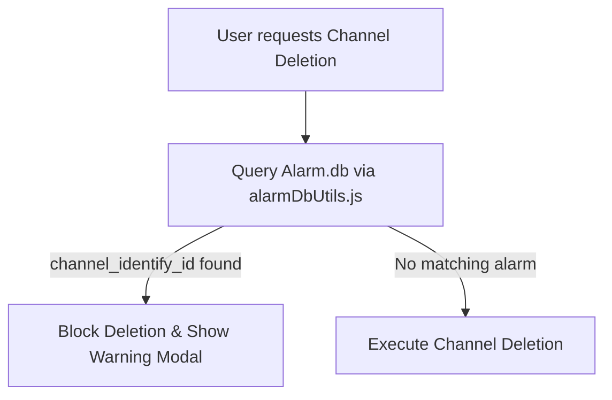

# DDD Analysis Report - Alarm Channel Deletion Invariant

## 1. Domain Invariant Definition
- **Aggregate Entity Boundary**: `SensorChannel` in `SUTO-SensorList.sutolist` <-> `AlarmRule` in `Alarm.db`.
- **Invariant**: An aggregate root `ConfigPackage` must not contain dangling `AlarmRule` references pointing to deleted `SensorChannel` identities.

## 2. Validation Flow

