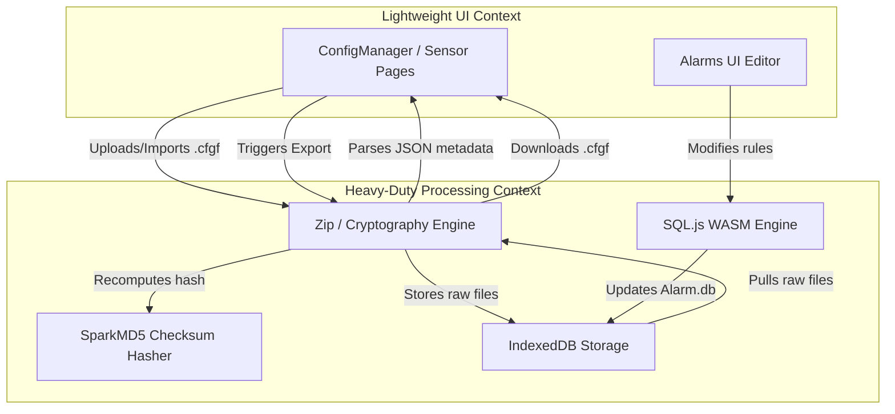
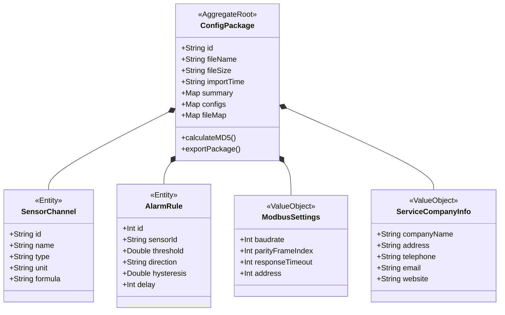
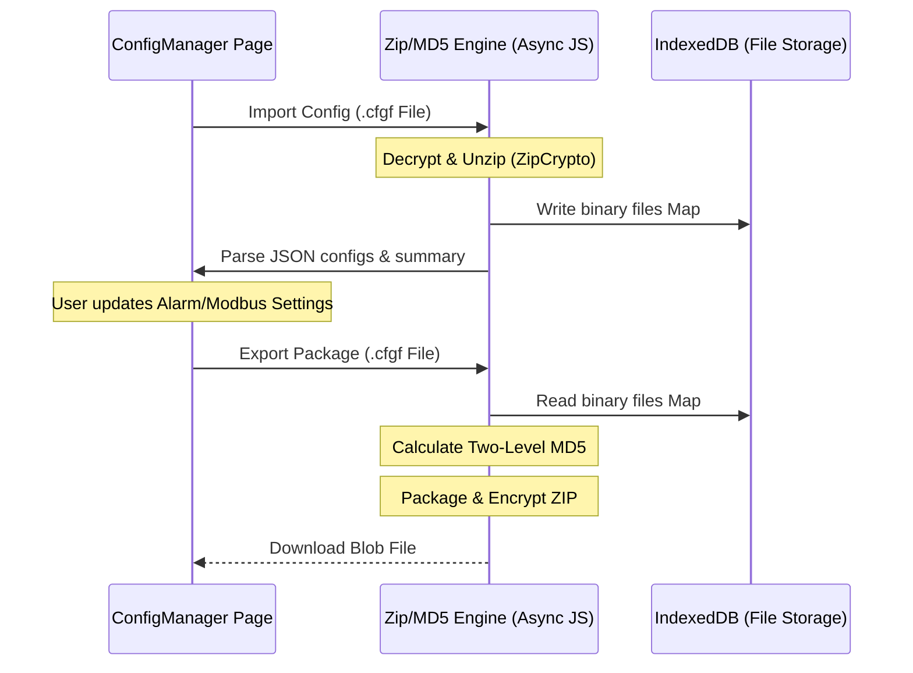

# Domain-Driven Design (DDD) Analysis Report - s4c-web Configuration Manager

This report defines the domain boundaries, bounded contexts, aggregate roots, core entities, and business invariants of the `s4c-web` browser-based configuration tool.

---

## 1. Bounded Contexts & Classifications

The business subdomains of the `s4c-web` workspace are classified into two primary contexts:

1. **Lightweight UI / CRUD Configuration Context** (Interactive UI Context):
   - **Responsibility**: Lightweight user interface page controllers, parameter editors (backlight, company details), sensor configuration modals, communication port settings inputs, and routing. Runs in the main browser thread.
2. **Config Package Serialization & Cryptography Context** (Heavy-Duty Processing Context):
   - **Responsibility**: Executing background tasks including encrypted ZIP decryption/decompression (ZipCrypto with password `SUTOXZCONFIG`), custom two-level MD5 integrity hash calculation, reading/writing configuration binary blobs to IndexedDB storage, and client-side SQL execution via `sql.js` (WebAssembly) on the `Alarm.db` database.

### Context Map (Mermaid Diagram)

---

## 2. Core Domain Entities & Attributes

The domain model is structured around a single aggregate root: the `ConfigPackage`.

- **ConfigPackage** (Aggregate Root):
  - Attributes:
    - `id` (string): Unique identifier generated upon load (e.g. `cfg-[timestamp]`).
    - `fileName` (string): The uploaded package file name.
    - `fileSize` (string): Human-readable file size (KB).
    - `importTime` (string): Import date timestamp.
    - `summary` (object): YAML metadata attributes parsed from `summary.yml`.
    - `configs` (object): Map of JSON configurations.
    - `fileMap` (Map): Map of ZIP relative paths (keys) to `Uint8Array` binary content (values).
  - Business Rules & Ownership: Owns and encapsulates all loaded configuration files and SQLite databases. Must register and sync file updates directly with IndexedDB file map storage.
- **SensorChannel** (Entity):
  - Attributes:
    - `id` (string): Channel identifier.
    - `name` (string): Name of the sensor or virtual channel.
    - `type` (string): Sensor manufacturer type (SUTO vs Third Party vs Virtual).
    - `unit` (string): Measurement physical unit (e.g. m³/h, °C, bar).
    - `formula` (string): Mathematical expression (for virtual channels only).
  - Business Rules: Belongs to `SUTO-SensorList.sutolist`. Must map to a valid physical port/modbus address or virtual formula.
- **AlarmRule** (Entity):
  - Attributes:
    - `id` (integer): Auto-incremented primary key.
    - `sensorId` (string): Linked sensor channel ID.
    - `threshold` (double): Physical threshold trigger.
    - `direction` (string): Direction of breach (UP/DOWN).
    - `hysteresis` (double): Hysteresis tolerance margin.
    - `delay` (integer): Delay in seconds before trigger.
  - Business Rules & Ownership: Owned by `Alarm.db` SQLite database. Changes are written via SQLite transactions.
- **ModbusSettings** (Value Object):
  - Attributes: `baudrate` (integer), `parityFrameIndex` (integer), `responseTimeout` (integer), `address` (integer).
  - Business Rules: Immutable configuration setting value objects representing RS485 communication port parameters.
- **ServiceCompanyInfo** (Value Object):
  - Attributes: `companyName` (string), `address` (string), `telephone` (string), `email` (string), `website` (string).
  - Business Rules: Immutable system metadata embedded in `system_info.json`.

### Domain Model (Mermaid Diagram)

---

## 3. Business Invariants & Constraints

- **Encryption Key Validation**: Opening or generating the `.cfgf` package container strictly requires encryption using the standard password `SUTOXZCONFIG`.
- **Package Signature Verification**: The final payload hash calculated from the alphabetically sorted file contents must match the value stored in the `hash` field of `summary.yml` exactly. Any mismatch aborts imports.
- **IndexedDB Isolation**: Binary content maps (especially `Alarm.db` and configuration templates) must be persisted in IndexedDB under keys corresponding to the `ConfigPackage` ID, preventing crossover corruption between loaded packages.

---

## 4. Execution & Offloading Strategy

To ensure fluid client-side rendering (60 FPS):
- Zip/Unzip tasks are performed asynchronously using Promise wrappers around `@zip.js/zip.js` workers (via [configFileUtils.js](file:///Users/ex/project/smallNfast/s4c-web/src/util/configFileUtils.js)).
- The sqlite database `Alarm.db` is processed asynchronously using pre-loaded WebAssembly (`sql.js`) to handle query commands in memory (via [alarmDbUtils.js](file:///Users/ex/project/smallNfast/s4c-web/src/util/alarmDbUtils.js)).
- Large binary writes to IndexedDB are run asynchronously using transaction-based storage hooks (via [fileMapStorage.js](file:///Users/ex/project/smallNfast/s4c-web/src/util/fileMapStorage.js)).

### Sequence Flow (Mermaid Diagram)

