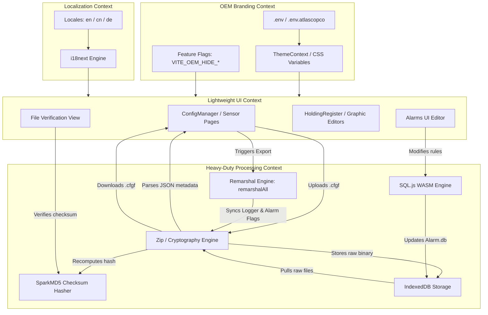
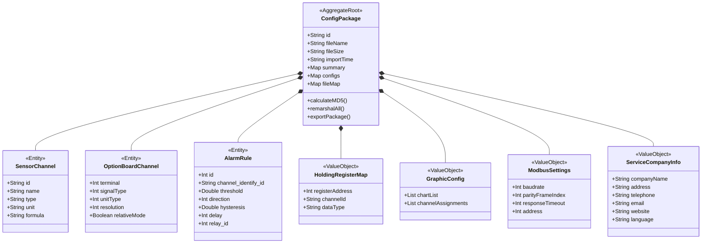
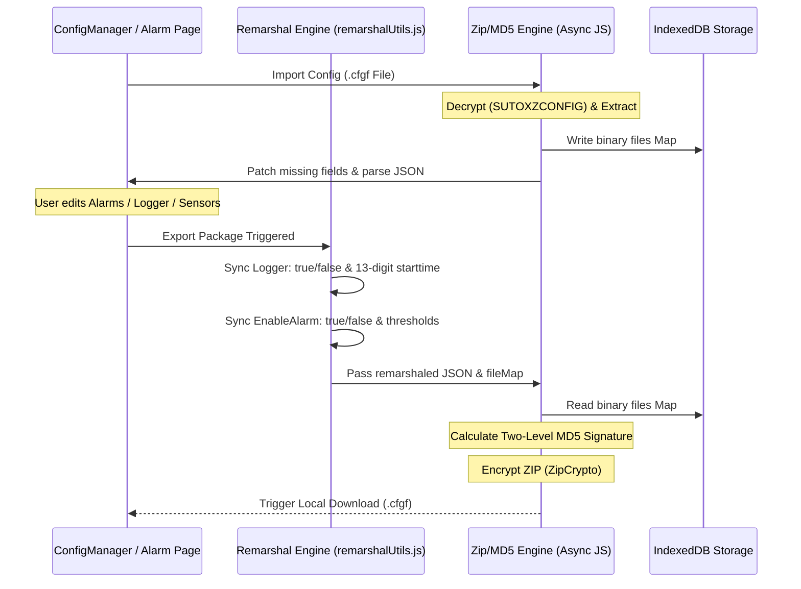

# Domain-Driven Design (DDD) Analysis Report - s4c-web Configuration Manager

This report defines the domain boundaries, bounded contexts, aggregate roots, core entities, value objects, domain invariants, context maps, and execution strategies of the `s4c-web` browser-based configuration tool.

---

## Modular DDD Subdomain Analysis Reports
For detailed sub-system domain models, context maps, and invariants, refer to the individual reports:
- 🎨 [OEM Multi-Tenant Branding DDD Report](file:///Users/ex/project/smallNfast/s4c-web/docs/report/oem_theming_ddd_report.md)
- 🌐 [Multi-Language (i18n) Subsystem DDD Report](file:///Users/ex/project/smallNfast/s4c-web/docs/report/i18n_localization_ddd_report.md)
- 🔄 [Device Remarshaling & Firmware Sync DDD Report](file:///Users/ex/project/smallNfast/s4c-web/docs/report/device_remarshal_sync_ddd_report.md)
- 🔌 [Option Board (Analog/Digital Input) DDD Report](file:///Users/ex/project/smallNfast/s4c-web/docs/report/option_board_ddd_report.md)
- 📊 [Holding Register Map & XLSX Export DDD Report](file:///Users/ex/project/smallNfast/s4c-web/docs/report/holding_register_xlsx_ddd_report.md)
- 🛡️ [File Verification Page DDD Report](file:///Users/ex/project/smallNfast/s4c-web/docs/report/file_verification_ddd_report.md)
- 🩹 [Defensive Config Migration & Patching DDD Report](file:///Users/ex/project/smallNfast/s4c-web/docs/report/defensive_config_patching_ddd_report.md)
- 🚫 [Alarm Channel Delete Restriction DDD Report](file:///Users/ex/project/smallNfast/s4c-web/docs/report/alarm_delete_restriction_ddd_report.md)
- 📈 [Graphic Data Visualization DDD Report](file:///Users/ex/project/smallNfast/s4c-web/docs/report/graphic_visualization_ddd_report.md)
- 🧪 [Automated Testing & CI/CD Pipeline DDD Report](file:///Users/ex/project/smallNfast/s4c-web/docs/report/ci_cd_testing_ddd_report.md)

---

## 1. Bounded Contexts & Classifications

The `s4c-web` application is organized into four distinct Bounded Contexts:

1. **Lightweight UI / CRUD Configuration Context**:
   - **Responsibility**: Page rendering, visual editors (backlight, company details, alarm views, communication settings, sensor channel modals, graphic layout tab management, holding register mapping). Runs in the main browser thread.
2. **Config Package Serialization & Cryptography Context**:
   - **Responsibility**: Background execution including encrypted ZIP decryption/decompression (`ZipCrypto` with password `SUTOXZCONFIG`), custom two-level MD5 checksum integrity calculation, reading/writing configuration binary blobs to IndexedDB (`s4c_config_db_v2`), and client-side WebAssembly SQL execution (`sql.js`) on `Alarm.db`.
3. **OEM Multi-Tenant Branding Context**:
   - **Responsibility**: Dynamic visual theming and page visibility control. Configured via environment variables (`.env`, `.env.atlascopco`). Injects CSS custom properties on `document.documentElement` (`ThemeContext.jsx`) and evaluates feature flags (`VITE_OEM_HIDE_*`) to show/hide specific navigation views.
4. **Internationalization & Localization Context (i18n)**:
   - **Responsibility**: Multi-language rendering (`react-i18next`) for English (`en.json`), Simplified Chinese (`cn.json`), and German (`de.json`). Persists active language selection inside `system_info.json` within the config package upon export.

### Context Map (Mermaid Diagram)

```mermaid
flowchart TD
    subgraph OEM ["OEM Branding Context"]
        ENV[.env / .env.atlascopco]
        TC[ThemeContext / CSS Variables]
        FF[Feature Flags: VITE_OEM_HIDE_*]
    end

    subgraph i18n ["Localization Context"]
        LOC[Locales: en / cn / de]
        I18N[i18next Engine]
    end

    subgraph UI ["Lightweight UI Context"]
        A[ConfigManager / Sensor Pages]
        E[Alarms UI Editor]
        H[HoldingRegister / Graphic Editors]
        V[File Verification View]
    end

    subgraph Worker ["Heavy-Duty Processing Context"]
        B[Zip / Cryptography Engine]
        C[SparkMD5 Checksum Hasher]
        D[SQL.js WASM Engine]
        F[IndexedDB Storage]
        R[Remarshal Engine: remarshalAll]
    end

    ENV --> TC
    TC --> UI
    FF --> UI
    LOC --> I18N
    I18N --> UI

    A -- Uploads .cfgf --> B
    B -- Stores raw binary --> F
    B -- Parses JSON metadata --> A
    E -- Modifies rules --> D
    D -- Updates Alarm.db --> F
    A -- Triggers Export --> R
    R -- Syncs Logger & Alarm Flags --> B
    F -- Pulls raw files --> B
    B -- Recomputes hash --> C
    B -- Downloads .cfgf --> A
    V -- Verifies checksum --> C
```

---

## 2. Core Domain Entities & Attributes

The domain model is structured around a single aggregate root: the `ConfigPackage`.

- **ConfigPackage** (Aggregate Root):
  - Attributes:
    - `id` (string): Unique identifier generated upon load (e.g. `cfg-[timestamp]`).
    - `fileName` (string): The uploaded package file name.
    - `fileSize` (string): Human-readable file size (KB).
    - `importTime` (string): Import date timestamp.
    - `summary` (object): YAML metadata attributes parsed from `summary.yml`.
    - `configs` (object): Map of parsed JSON configuration documents.
    - `fileMap` (Map): Map of ZIP relative paths (keys) to `Uint8Array` binary content (values).
  - Business Rules: Owns and encapsulates all loaded configuration files and SQLite databases. Must register and sync file updates directly with IndexedDB file map storage and run `remarshalAll()` before export.
- **SensorChannel** (Entity):
  - Attributes: `id`, `name`, `type` (SUTO, Third Party, Virtual), `unit`, `formula` (for virtual channels).
  - Domain Rules: Belongs to `SUTO-SensorList.sutolist`. Cannot be deleted if an active `AlarmRule` references its identity (`channel_identify_id` / `CreateTime`).
- **OptionBoardChannel** (Entity):
  - Attributes: `terminal` (X9–X16), `signalType` (Analog: 0-20mA, 4-20mA, 0.5-4.5V, 0-10V; Digital: Counter, Runtime, Status), `unitType` (Dew point, Pressure, Flow, etc.), `resolution` (-6 to +3), `relativeMode` (boolean).
  - Domain Rules: Defined in `cfgOptionBoard.json`.
- **AlarmRule** (Entity):
  - Attributes: `config_id` (Primary Key), `sensor_identify_id`, `channel_identify_id`, `threshold`, `direction` (0 = Above/UP, 1 = Below/DOWN), `hysteresis`, `delay`, `relay_id`, `relay_flag`.
  - Domain Rules: Owned by `Alarm.db` SQLite database. Written via SQLite WASM transactions and synchronized to channel JSON flags via `remarshalAll()`.
- **HoldingRegisterMap** (Value Object):
  - Attributes: `registerAddress`, `channelId`, `dataType`, `accessMode`.
  - Domain Rules: Maps physical channels to Modbus holding registers. Can be exported to `.xlsx` spreadsheets.
- **GraphicConfig** (Value Object):
  - Attributes: `chartList`, `activeCharts`, `channelAssignments`, `refreshRate`.
  - Domain Rules: Saved inside `config/cfgGraphic.json`.
- **ModbusSettings** (Value Object):
  - Attributes: `baudrate`, `parityFrameIndex`, `responseTimeout`, `address`.
  - Domain Rules: Saved in `system/cfgcommunicatport.json`.
- **ServiceCompanyInfo** (Value Object):
  - Attributes: `companyName`, `address`, `telephone`, `email`, `website`, `language`.
  - Domain Rules: System metadata embedded in `system/system_info.json`.

### Domain Model (Mermaid Diagram)

```mermaid
classDiagram
    class ConfigPackage {
        <<AggregateRoot>>
        +String id
        +String fileName
        +String fileSize
        +String importTime
        +Map summary
        +Map configs
        +Map fileMap
        +calculateMD5()
        +remarshalAll()
        +exportPackage()
    }
    class SensorChannel {
        <<Entity>>
        +String id
        +String name
        +String type
        +String unit
        +String formula
    }
    class OptionBoardChannel {
        <<Entity>>
        +Int terminal
        +Int signalType
        +Int unitType
        +Int resolution
        +Boolean relativeMode
    }
    class AlarmRule {
        <<Entity>>
        +Int id
        +String channel_identify_id
        +Double threshold
        +Int direction
        +Double hysteresis
        +Int delay
        +Int relay_id
    }
    class HoldingRegisterMap {
        <<ValueObject>>
        +Int registerAddress
        +String channelId
        +String dataType
    }
    class GraphicConfig {
        <<ValueObject>>
        +List chartList
        +List channelAssignments
    }
    class ModbusSettings {
        <<ValueObject>>
        +Int baudrate
        +Int parityFrameIndex
        +Int responseTimeout
        +Int address
    }
    class ServiceCompanyInfo {
        <<ValueObject>>
        +String companyName
        +String address
        +String telephone
        +String email
        +String website
        +String language
    }

    ConfigPackage *-- SensorChannel
    ConfigPackage *-- OptionBoardChannel
    ConfigPackage *-- AlarmRule
    ConfigPackage *-- HoldingRegisterMap
    ConfigPackage *-- GraphicConfig
    ConfigPackage *-- ModbusSettings
    ConfigPackage *-- ServiceCompanyInfo
```

---

## 3. Core Business Invariants & Hardware Constraints

1. **Device Remarshaling & Firmware Synchronization Invariants (`remarshalAll`)**:
   - **Logger Flag Sync**: Every channel in `SUTO-SensorList.sutolist` and `cfgOptionBoard.json` must have `"Logger": true` if present in `cfglogger.json::channelArray`, and `"Logger": false` if unselected.
   - **Logger Starttime Format**: `starttime` in `cfglogger.json` is stored as a **13-digit Unix timestamp in milliseconds**.
   - **Alarm Flag & Threshold Sync**: Channel objects in `SUTO-SensorList.sutolist` and `cfgOptionBoard.json` must have `"EnableAlarm": true/false`, `Direction`, `MaxThreshold`/`MinThreshold`, `MaxHysteresis`/`MinHysteresis`, and `RelayIndex` synchronized with active rules in `Alarm.db`. Embedded C hardware checks `"EnableAlarm"` on sensor channels before reading `Alarm.db`.
2. **Sensor Channel Deletion Restriction Invariant**:
   - A sensor channel cannot be deleted from `SUTO-SensorList.sutolist` if any row in `Alarm.db` references `channel_identify_id` matching the channel's `CreateTime`.
3. **Defensive Config Migration / Patching Invariant**:
   - On importing legacy `.cfgf` packages, any missing JSON sections or properties must be patched with safe defaults before passing data to UI components.
4. **Encryption Key & Package Signature Validation**:
   - Packages strictly require ZIP traditional encryption using standard password `SUTOXZCONFIG`.
   - The payload hash calculated from alphabetically sorted ZIP file paths must match `summary.hash` exactly.

---

## 4. Execution & Offloading Strategy

- **Zip/Unzip Operations**: Executed asynchronously using Promise workers via `@zip.js/zip.js` ([configFileUtils.js](file:///Users/ex/project/smallNfast/s4c-web/src/util/configFileUtils.js)).
- **SQLite Database Execution**: Processed asynchronously via WebAssembly (`sql.js` loading `public/sql-wasm.wasm`) ([alarmDbUtils.js](file:///Users/ex/project/smallNfast/s4c-web/src/util/alarmDbUtils.js)).
- **IndexedDB Isolation**: Binary content maps (`fileMap`) are stored under keys corresponding to `ConfigPackage.id` in store `filemaps` of DB `s4c_config_db_v2` ([fileMapStorage.js](file:///Users/ex/project/smallNfast/s4c-web/src/util/fileMapStorage.js)).
- **Automated Verification**: Vitest unit test suite executed in CI/CD pipeline via GitHub Actions on Node 22 (`--pool=forks`).

### Sequence Flow (Mermaid Diagram)

```mermaid
sequenceDiagram
    participant UI as ConfigManager / Alarm Page
    participant R as Remarshal Engine (remarshalUtils.js)
    participant JS as Zip/MD5 Engine (Async JS)
    participant IDB as IndexedDB Storage
    UI->>JS: Import Config (.cfgf File)
    Note over JS: Decrypt (SUTOXZCONFIG) & Extract
    JS->>IDB: Write binary files Map
    JS->>UI: Patch missing fields & parse JSON
    Note over UI: User edits Alarms / Logger / Sensors
    UI->>R: Export Package Triggered
    R->>R: Sync Logger: true/false & 13-digit starttime
    R->>R: Sync EnableAlarm: true/false & thresholds
    R->>JS: Pass remarshaled JSON & fileMap
    JS->>IDB: Read binary files Map
    Note over JS: Calculate Two-Level MD5 Signature
    Note over JS: Encrypt ZIP (ZipCrypto)
    JS-->>UI: Trigger Local Download (.cfgf)
```
