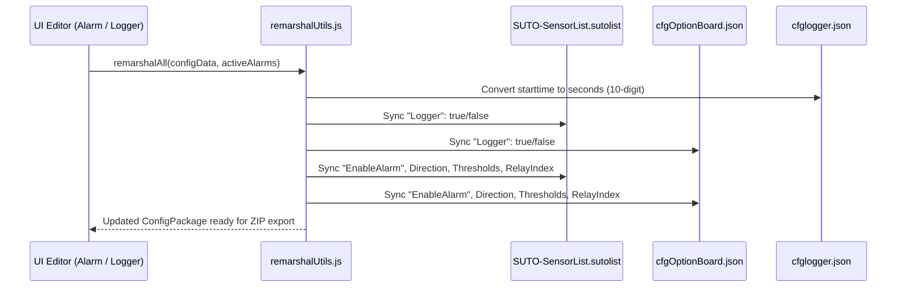

# DDD Analysis Report - Device Remarshaling & Synchronization Bounded Context

## 1. Bounded Context Classification
- **Name**: Device Remarshaling & Firmware Synchronization Context
- **Classification**: Core Domain Subdomain
- **Responsibility**: Enforcing state consistency between SQLite database files (`Alarm.db`), high-level JSON logger files (`cfglogger.json`), and physical channel descriptor lists (`SUTO-SensorList.sutolist`, `cfgOptionBoard.json`).

## 2. Context Interaction Flow

## 3. Domain Invariants
1. **Timestamp Invariant**: `starttime` > 1e11 (milliseconds) must be converted to seconds by dividing by 1000 before packaging.
2. **Channel Flag Invariant**: Every active channel in `Alarm.db` must have `"EnableAlarm": true` in `SUTO-SensorList.sutolist`. Channels without active alarm rules must have `"EnableAlarm": false`.
3. **Logger Flag Invariant**: Channels present in `cfglogger.json::channelArray` must have `"Logger": true`.
