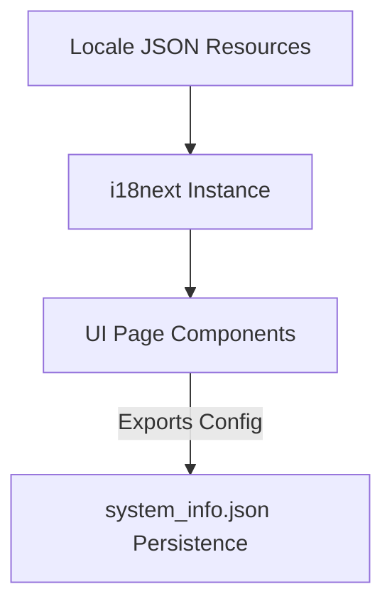

# DDD Analysis Report - Localization & i18n Bounded Context

## 1. Bounded Context Classification
- **Name**: Localization & i18n Bounded Context
- **Classification**: Supporting Subdomain
- **Responsibility**: Locale dictionary management, key-based translation rendering, language state persistence in package metadata.

## 2. Structural Interaction
The i18n Context provides translation services to all UI page components via `useTranslation()`.

## 3. Invariants & Translation Contract
1. Translation keys must match across `en.json`, `cn.json`, and `de.json`.
2. Fallback locale defaults to `en.json` if a translation key is missing.
3. Domain terms (e.g. Trigger Direction, Above, Below, Pending) must adhere strictly to approved industrial automation terminology.
