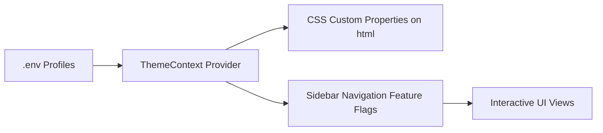

# DDD Analysis Report - OEM Multi-Tenant Branding Context

## 1. Bounded Context Classification
- **Name**: OEM Multi-Tenant Branding Context
- **Classification**: Generic Subdomain / Presentation Layer Infrastructure
- **Responsibility**: Dynamic style variable injection, branding asset resolution, and feature toggle enforcement.

## 2. Context Boundary & Relationships
The OEM Branding Context sits at the presentation layer boundary. It decorates the Interactive UI Context with visual styling tokens and controls top-level router/navigation accessibility.

## 3. Key Entities & Value Objects
- **ThemeConfig (Value Object)**:
  - `appName` (string)
  - `appLogo` (string)
  - `logoHeight` (string)
  - `favicon` (string)
  - `primaryColor`, `accentColor`, `sidebarBg`, `btnRadius` (CSS Color & Style Tokens)
- **FeatureToggleMap (Value Object)**:
  - `hideFileVerification` (boolean)
  - `hideDataAnalysis` (boolean)
  - `hideSupport` (boolean)

## 4. Domain Rules & Invariants
1. Core domain logic (alarm evaluation, package checksum calculation, DB transactions) must remain completely decoupled from OEM styling flags.
2. Styling custom properties must be applied at document root initialization before child page rendering occurs.
