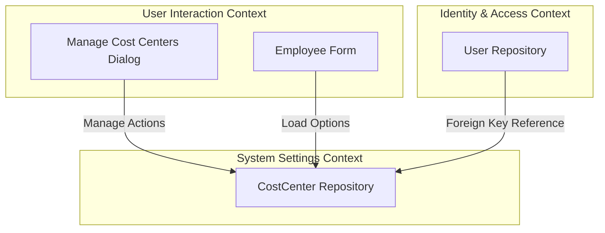
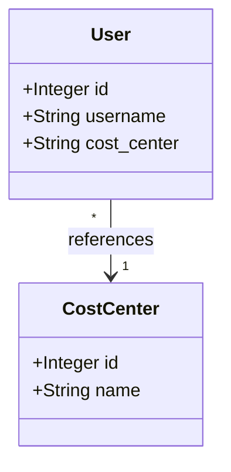
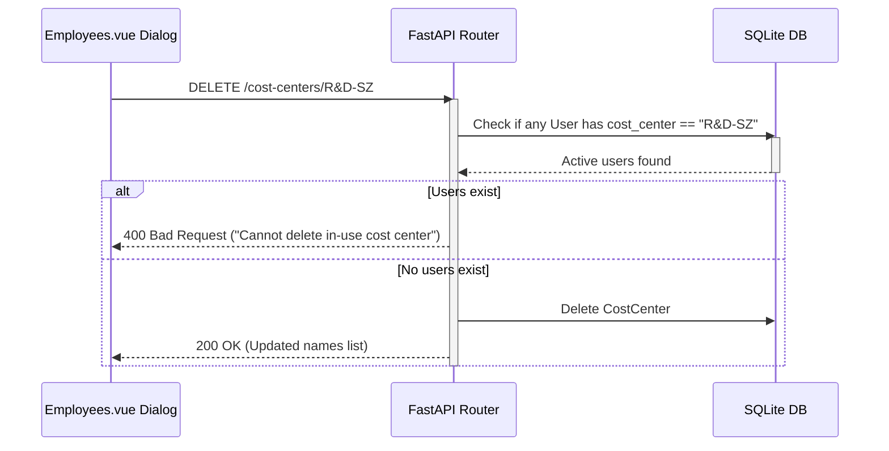

# Domain-Driven Design (DDD) Analysis Report - Database-Backed Cost Centers

This report details the domain design, entities, invariants, and sequence flow for migrating cost centers to database-backed storage.

---

## 1. Bounded Contexts & Classifications

* **System Settings & Metadata Context (Lightweight Transactional)**: Responsible for managing configurations, including the newly introduced `CostCenter` aggregate.
* **Identity & Access Management Context (Lightweight Transactional)**: Manages users and roles, and contains the `User` aggregate root which references cost centers.

### Context Map (Mermaid Diagram)

---

## 2. Core Domain Entities & Attributes

* **CostCenter (Entity)**:
  - Attributes: `id` (Integer, Primary Key), `name` (String, Unique, Indexed).
  - Business Rules: Unique names. Cannot delete if referenced by any User.
* **User (Aggregate Root)**:
  - Attributes: `cost_center` (String, Foreign Key referencing `costcenter.name`).

### Domain Model (Mermaid Diagram)

---

## 3. Business Invariants & Constraints

1. **Unique Names:** Each CostCenter name must be unique.
2. **Referential Integrity:** A user's `cost_center` must match a valid `CostCenter.name` in the database.
3. **No Deletion of Active Cost Centers:** Deleting a cost center that is currently referenced by one or more users must raise a `400 Bad Request` or fail database constraints.
4. **Seed Defaults:** On database initialization/startup, the default cost centers (`R&D-SZ`, `R&D-XA`) must be seeded if the `CostCenter` table is empty.

---

## 4. Execution & Offloading Strategy

All DB queries (reads and writes) to the `CostCenter` table will run within standard SQLite sessions. Since WAL mode is enabled, database queries are asynchronous-friendly and will run synchronously in the FastAPI requests.

### Sequence Flow (Mermaid Diagram)

