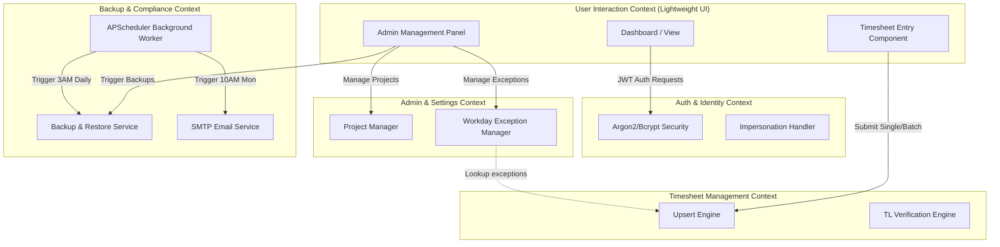
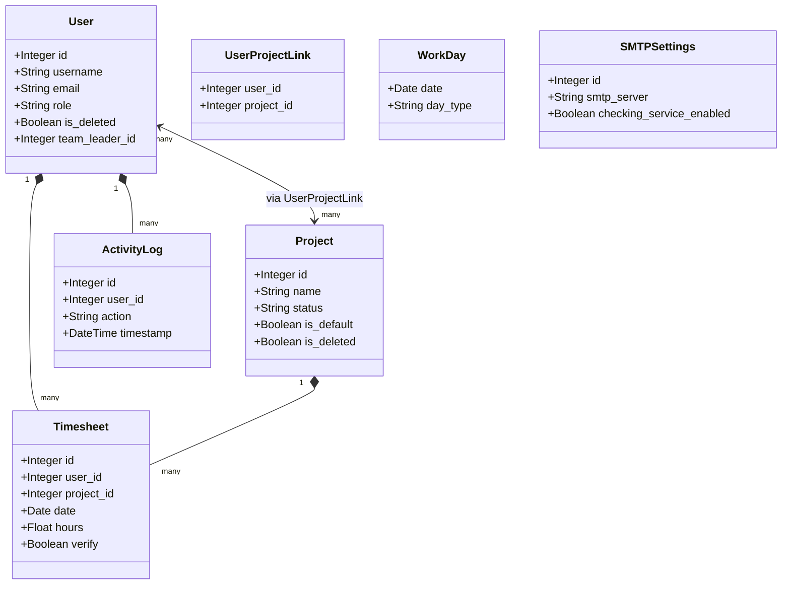
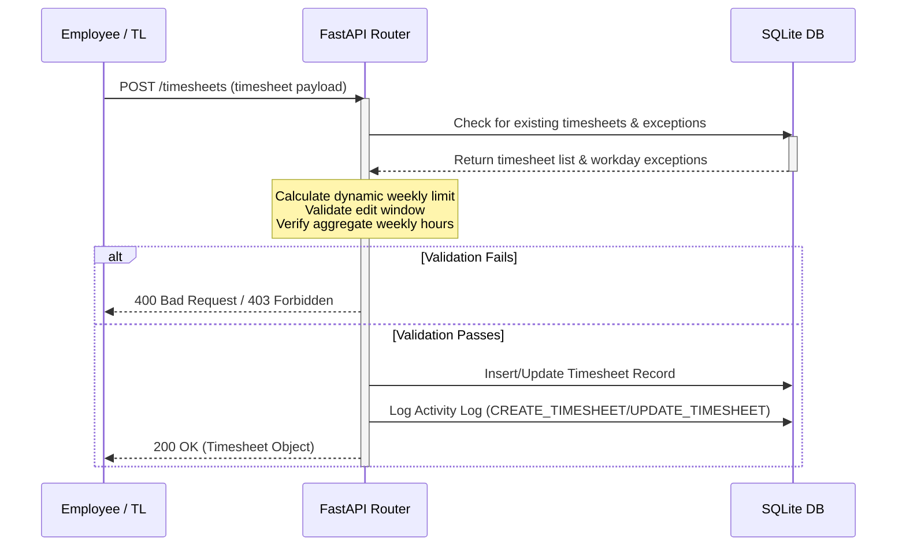

# Domain-Driven Design (DDD) Analysis Report - Timesheet Lite Baseline

This report describes the Bounded Contexts, Core Entities, Invariants, and execution strategies of the Timesheet Lite system.

---

## 1. Bounded Contexts & Classifications

* **User Interaction Context (Lightweight UI)**: The frontend single page application. Responsible for handling user inputs, presenting timesheet calendars, drawing reporting charts, and managing client-side routing.
* **Authentication & Identity Context (Lightweight Transactional)**: Manages authentication, token issuance (JWT), role claims, and admin impersonation.
* **Timesheet Management Context (Heavy-Duty Transactional)**: Enforces business logic for logging hours: weekly limits calculation, edit window validation, off-day checks, batch overwrites, and Team Leader verifications.
* **Administration & System Settings Context (Lightweight Management)**: Handles configuration metadata (SMTP settings, Workday holiday exceptions, Cost Centers) and project definitions.
* **Backup & Compliance Context (Heavy-Duty Processing)**: Runs scheduled asynchronous background jobs (sending reminder emails, performing SQLite WAL-safe backups, and cleaning up old files).

### Context Map (Mermaid Diagram)

---

## 2. Core Domain Entities & Attributes

* **User (Aggregate Root)**:
  - Attributes: `id`, `username`, `email`, `full_name`, `cost_center`, `remark`, `start_date`, `end_date`, `password_hash`, `role` (`admin`/`team_leader`/`employee`), `is_deleted`, `team_leader_id`.
  - Invariants: Unique `username`. Employees must have a team leader (`team_leader_id`). Admins cannot log time.
* **Project (Aggregate Root)**:
  - Attributes: `id`, `name`, `full_name`, `chinese_name`, `custom_id`, `status` (`NOT_START`/`RUN`/`CLOSE`), `start_date`, `plan_closed_date`, `actual_closed_date`, `others`, `remark`, `description`, `is_default`, `is_deleted`.
  - Invariants: Unique `name`. Default projects are visible to all users; non-default projects require explicit links in `UserProjectLink`.
* **Timesheet (Entity)**:
  - Attributes: `id`, `user_id`, `project_id`, `date`, `hours`, `verify` (`bool`), `created_at`, `updated_at`.
  - Invariants: Cannot log time on `OFF` days. Total weekly hours cannot exceed dynamic weekly limit. Once `verify` is true, cannot be updated by employee.
* **WorkDay (Value Object / Configuration)**:
  - Attributes: `date`, `day_type` (`work`/`off`/`half_off`), `remark`.
  - Invariants: Key is the unique calendar date. Configures timesheet weekly limit rules.
* **ActivityLog (Value Object)**:
  - Attributes: `id`, `user_id`, `action`, `details`, `timestamp`.
  - Invariants: Immutable. Generated automatically on database updates.
* **SMTPSettings (Value Object / Configuration)**:
  - Attributes: `id`, `smtp_server`, `smtp_port`, `smtp_username`, `smtp_password`, `sender_email`, `checking_service_enabled`.

### Domain Model (Mermaid Diagram)

---

## 3. Business Invariants & Constraints

1. **Admins Cannot Log Work:** Any attempt by an `admin` user to save or modify a timesheet must throw a `403 Forbidden` error.
2. **Off-Day Enforcement:** Timesheet entries for dates marked as `WorkDayType.OFF` (either explicitly in settings or by default on weekends) must reject hours > 0 with `400 Bad Request`.
3. **Dynamic Weekly Limits:** Calculated dynamically for the Mon-Sun ISO week containing the target timesheet date. The week's limits are computed as:
   - Weekdays (Mon-Fri) without exception: 8.0 hours.
   - Weekends (Sat-Sun) without exception: 0.0 hours.
   - Days with explicit `WorkDayType.WORK`: 8.0 hours.
   - Days with explicit `WorkDayType.HALF_OFF`: 4.0 hours.
   - Days with explicit `WorkDayType.OFF`: 0.0 hours.
   If the proposed timesheet entry exceeds `limit - existing_hours_for_week`, throw a `400 Bad Request`.
4. **Edit Window Limits:**
   - Single-entry timesheet updates by an employee must not be older than the start of the current week minus 2 weeks.
   - Batch timesheet updates by an employee must not contain dates older than 30 days.
   - Admins and Team Leaders are exempt from these date checks.
5. **Deduplication:** A user can only have one timesheet entry per date per project.
6. **Zero-Hour Deletion:** Timesheet entries with `hours == 0` are automatically pruned from the database.
7. **Verification Limits:** Team leaders cannot verify days where the user's total hours logged exceed 8.0 hours.

---

## 4. Execution & Offloading Strategy

* **SQLite WAL-safe backups:** Uses SQLite's `VACUUM INTO` command rather than simple copy operations to ensure that active transactions in WAL files do not corrupt the backup file.
* **Asynchronous Cron Tasks:** Executed out-of-band using APScheduler background threads, preventing blocking of FastAPI's main event loops.

### Sequence Flow (Mermaid Diagram)

