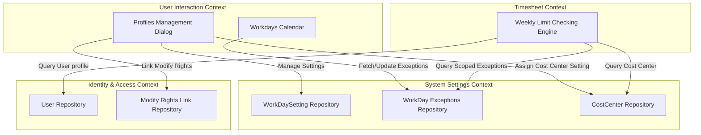
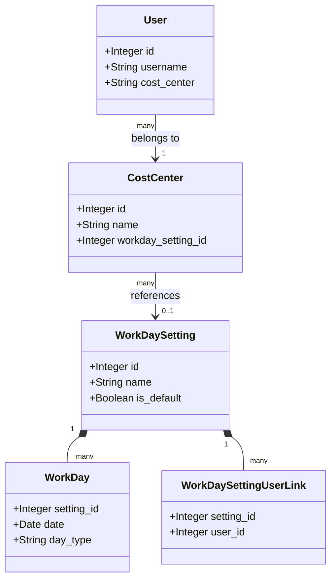
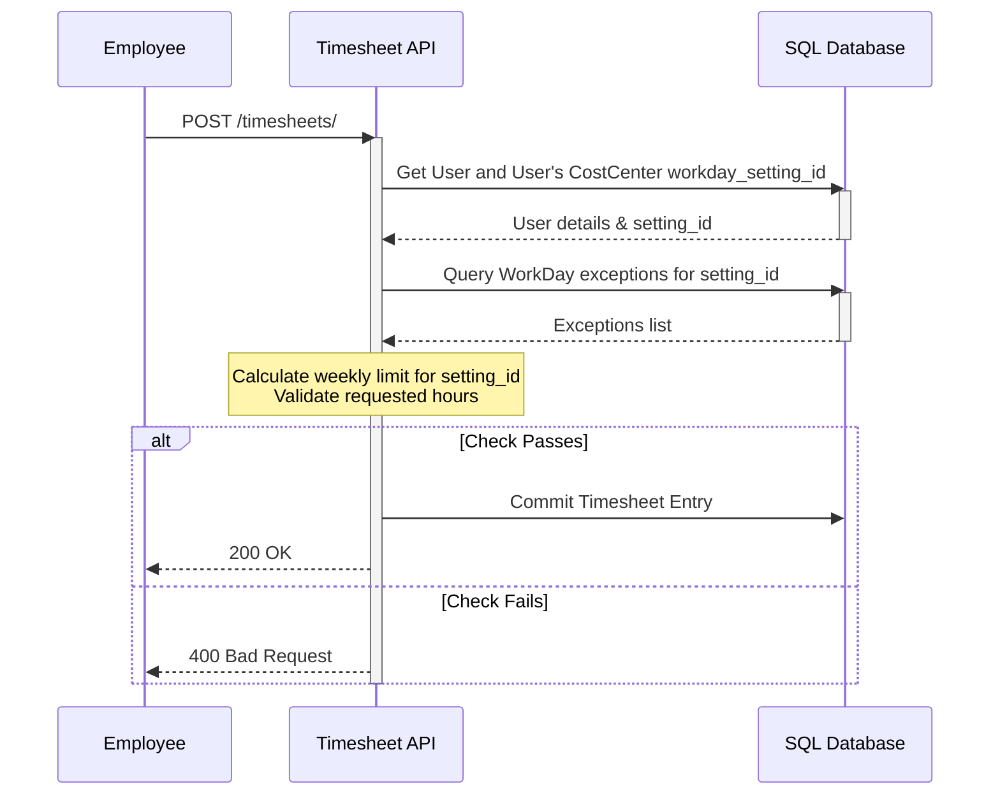

# Domain-Driven Design (DDD) Analysis Report - Hierarchical Workday Settings

This report defines the domain boundaries, entity schemas, invariants, and sequence flows for the hierarchical workday exceptions settings feature.

---

## 1. Bounded Contexts & Classifications

* **System Settings & Metadata Context (Lightweight Transactional)**: Includes `WorkDaySetting` (profile definitions), `WorkDay` (scoped calendar exceptions), and `CostCenter` configurations.
* **Identity & Access Management Context (Lightweight Transactional)**: Manages `User` profiles and access policies (linked permissions for modifying workday settings).
* **Timesheet Processing Context (Heavy-Duty Transactional)**: Performs weekly limit checks during upserts, resolving the user's workday setting profile dynamically.

### Context Map (Mermaid Diagram)

---

## 2. Core Domain Entities & Attributes

* **WorkDaySetting (Aggregate Root)**:
  - Attributes: `id` (Integer, PK), `name` (String, Unique), `description` (String), `is_default` (Boolean).
* **WorkDay (Entity)**:
  - Attributes: `setting_id` (Integer, FK, composite PK), `date` (Date, composite PK), `day_type` (Enum: `work`/`off`/`half_off`), `remark` (String).
* **WorkDaySettingUserLink (Value Object)**:
  - Attributes: `setting_id` (Integer, FK, PK), `user_id` (Integer, FK, PK).
* **CostCenter (Entity)**:
  - Attributes: `workday_setting_id` (Integer, Nullable FK).

### Domain Model (Mermaid Diagram)

---

## 3. Business Invariants & Constraints

1. **At Least One Default:** A default workday setting profile (`is_default = True`) named `"Default"` must always exist.
2. **Immutable Default Deletion:** The default settings profile cannot be deleted.
3. **Scoped Exception Editing:** To create, edit, or delete exceptions in `WorkDay`, a user must be an `admin` or have their `user_id` mapped to that `setting_id` in `WorkDaySettingUserLink`.
4. **Fallback Scoping:** If a user does not have a cost center, or if their cost center does not map to any `workday_setting_id`, their timesheet checks default to using the exceptions from the `Default` profile.
5. **Cost Center Uniqueness:** Cost Center names remain unique. Only admins can update the mapping between a cost center and a workday setting.

---

## 4. Execution & Offloading Strategy

All workday boundary mapping resolves dynamically in the request threads. When an employee logs hours:
1. Fetch the user's cost center.
2. Retrieve the cost center's setting profile.
3. Retrieve exceptions for that setting profile.
4. Calculate limits based on weekday status and overrides.

### Sequence Flow (Mermaid Diagram)

